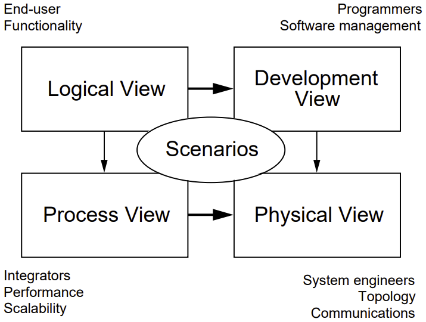

> # Softwareentwicklung 1

*Lucas Rosina (rosinluc)*

- [Cheatsheet / Glossar](#cheatsheet--glossar)
  - [Akteur (actor):](#akteur-actor)
  - [Domänenmodell:](#domänenmodell)
  - [FURPS+](#furps)
  - [Operation Contract:](#operation-contract)
  - [Softwarearchitektur:](#softwarearchitektur)
  - [System under Development (SuD):](#system-under-development-sud)
  - [Use-Case (UC):](#use-case-uc)
- [1. Anforderungsanalyse I](#1-anforderungsanalyse-i)
  - [1.1 Usability und User Experience (UX)](#11-usability-und-user-experience-ux)
  - [1.2 DIN EN ISO 9241-110](#12-din-en-iso-9241-110)
    - [1.3 User-Centered Design](#13-user-centered-design)
      - [User \& Domain Research](#user--domain-research)
        - [Persona](#persona)
        - [Szenarien](#szenarien)
        - [Mentales Modell](#mentales-modell)
        - [Stakeholder Map](#stakeholder-map)
        - [Service Blueprint / Geschäftsmodell](#service-blueprint--geschäftsmodell)
        - [Weitere Artefakte](#weitere-artefakte)
      - [Anforderungsanalyse (Requirements Analysis)](#anforderungsanalyse-requirements-analysis)
        - [Kontextszenario](#kontextszenario)
        - [Storyboard](#storyboard)
      - [Design \& Prototype](#design--prototype)
      - [Evaluate](#evaluate)
- [2. Anforderungsanalyse II](#2-anforderungsanalyse-ii)
  - [2.1 Use-Cases](#21-use-cases)
      - [**Akteure**](#akteure)
    - [2.1.1 Anwendungsfalldiagramm (Use-Case-Diagramm)](#211-anwendungsfalldiagramm-use-case-diagramm)
    - [2.1.2 Fully-dressed UC](#212-fully-dressed-uc)
  - [2.2 Sequenzdiagramm (SSD)](#22-sequenzdiagramm-ssd)
  - [2.3 Funktionale und Nicht-funktionale Anforderungen (Supplementary Specification)](#23-funktionale-und-nicht-funktionale-anforderungen-supplementary-specification)
- [3. Domänenmodellierung](#3-domänenmodellierung)
  - [3.1 Grundlagen](#31-grundlagen)
  - [3.2 Vorgehen](#32-vorgehen)
    - [3.2.1 Kategorienliste](#321-kategorienliste)
    - [3.2.2 Vorgehensweise Kartografen](#322-vorgehensweise-kartografen)
  - [3.3 Analysemuster](#33-analysemuster)
    - [3.3.1 Beschreibungsklasse](#331-beschreibungsklasse)
    - [3.3.2 Generalisierung und Spezialisierung](#332-generalisierung-und-spezialisierung)
    - [3.3.3 Assoziationsklassen](#333-assoziationsklassen)
- [4 Softwarearchitektur und Design I](#4-softwarearchitektur-und-design-i)
  - [4.1 Softwarearchitektur:](#41-softwarearchitektur)
  - [4.2 Architektur Anforderungen ableiten](#42-architektur-anforderungen-ableiten)
    - [nicht-funktionale Anfordernungen](#nicht-funktionale-anfordernungen)
  - [4.3 Modulkonzept](#43-modulkonzept)
    - [Schnittstellen (Interfaces)](#schnittstellen-interfaces)
    - [Kapselung und Austauschbarkeit](#kapselung-und-austauschbarkeit)
    - [Messung der Güte Modularisierung](#messung-der-güte-modularisierung)
    - [Clean Architecture](#clean-architecture)
    - [N+1 View Model](#n1-view-model)
    - [Arc42](#arc42)
  - [4.4 UML-Paketdiagramme](#44-uml-paketdiagramme)
  - [4.5 Verteilungsdiagramm](#45-verteilungsdiagramm)
  - [4.6 Beispiel Architekturpatterns](#46-beispiel-architekturpatterns)
- [5 Softwarearchitektur und Design II](#5-softwarearchitektur-und-design-ii)
  - [5.1 Klassen entwerfen](#51-klassen-entwerfen)
  - [5.2 UML-Klassendiagramm](#52-uml-klassendiagramm)
  - [5.3 UML-Interaktionsdiagramme](#53-uml-interaktionsdiagramme)
    - [Sequenzdiagramm](#sequenzdiagramm)
    - [Kommunikationsdiagramm](#kommunikationsdiagramm)
    - [Zustandsdiagramm](#zustandsdiagramm)
    - [Aktivitätsdiagramm](#aktivitätsdiagramm)
  - [5.4 Klassen mit Verantwortlichkeiten entwerfen](#54-klassen-mit-verantwortlichkeiten-entwerfen)
    - [Responsibility-Driven-Design (RDD)](#responsibility-driven-design-rdd)
    - [GRASP](#grasp)
      - [GRASP-Patterns](#grasp-patterns)
- [6 Implementation, Refactoring und Testing](#6-implementation-refactoring-und-testing)
  - [6.1 Implementation](#61-implementation)
    - [Fehlerbehandlung](#fehlerbehandlung)
    - [Umsetzungs-Reihenfolge AGIL](#umsetzungs-reihenfolge-agil)
    - [Codierrichtlinien](#codierrichtlinien)
    - [Namensgebung - Klassen, Methoden, Variablen](#namensgebung---klassen-methoden-variablen)
    - [Implementierungsstrategie](#implementierungsstrategie)
    - [Laufzeit Optimierung](#laufzeit-optimierung)
  - [6.2 Refactoring](#62-refactoring)
    - [Refactoring Patterns](#refactoring-patterns)
  - [6.3 Testing](#63-testing)
    - [Testarten](#testarten)
    - [Begriffe](#begriffe)
- [7 Design Pattern](#7-design-pattern)
  - [Alle Patterns auf *refactoring.guru*](#alle-patterns-auf-refactoringguru)
- [8 Verteilte Systeme](#8-verteilte-systeme)
  - [8.1 Design- und Implementierungskonzepte Client-Server](#81-design--und-implementierungskonzepte-client-server)
  - [8.2 Middleware](#82-middleware)
- [9. GUI-Architekturen](#9-gui-architekturen)
  - [9.1 Einführung](#91-einführung)
    - [Schichtenarchitektur Vergleich](#schichtenarchitektur-vergleich)
  - [9.2 Patterns für GUIs (GUI Pattern)](#92-patterns-für-guis-gui-pattern)
    - [Observer Pattern](#observer-pattern)
    - [Model View Controller (MVC, MVP, MVVM)](#model-view-controller-mvc-mvp-mvvm)
    - [Composite Pattern](#composite-pattern)
- [10 Persistenz](#10-persistenz)
  - [10.1 Einführung](#101-einführung)
  - [10.2 Design-Optionen](#102-design-optionen)
    - [Design Pattern](#design-pattern)
  - [10.3 Persistenz mit JDBC](#103-persistenz-mit-jdbc)
  - [10.4 O/R-Mapping mit DAO](#104-or-mapping-mit-dao)
  - [10.4 O/R-Mapping mit JPA](#104-or-mapping-mit-jpa)
    - [Transaktions](#transaktions)
- [11 Frameworks](#11-frameworks)
  - [11.1 Design Patterns](#111-design-patterns)
  - [11.2 Moderne Framework Patterns](#112-moderne-framework-patterns)
    - [Annotationen](#annotationen)
  - [11.3](#113)
  - [11.4](#114)
  - [11.5](#115)

# Cheatsheet / Glossar

## Akteur (actor): 
Externe Person in einer bestimmten Rolle. Interagiert mit dem zu entwickelnden System.
- können auch externe **Systeme, Organistationen** oder **Maschinen** sein.
- **Zeit** auch Akteur (Zeitabhängige UCs)

## Domänenmodell:
- Ist ein vereinfachtes UML Klassendiagramm.
- Es zeigt fachliche Begriffe mit ihren Attributen, setzt Begriffe in eine Beziehung.
- Es geht noch nicht um SW
- bestehende Begriffe verwenden und nichts erfindet, was es nicht schon gibt.
- Analyse-Muster

## FURPS+
- **F**unctionality (Funktionalität)
    - Features, Fähigkeiten, Sicherheit
- **U**sability (Gebrauchstauglichkeit)
    - Siehe Usability-Anforderungen
    - Accessibility (Benutzer mit spez. Bedürfnissen)
- **R**eliability (Zuverlässigkeit)
    - Fehlerrate, Wiederanlauffähigkeit, Vorhersagbarkeit, Datensicherung
- **P**erformance (Performanz)
    - Reaktionszeiten, Durchsatz, Genauigkeit, Verfügbarkeit, Ressourceneinsatz
- **S**upportability (Unterstützbarkeit)
    - Anpassungsfähigkeit, Wartbarkeit, Internationalisierung, Konfigurierbarkeit
- **+**
    - Implementation: HW, Betriebssysteme, Sprachen, Tests, Werkzeuge,..
    - Interface: Schnittstellen von ext. Systemen, Protokolle
    - Operations: Betriebliche Aspekte
    - Packaging (Verpackung): Auslieferung physisch, logisch (Container, Plugin,..)
    - Legal: Lizenzen, rechtl. Rahmenbedingungen

## Operation Contract:
Eine (System) Operation kann mit einem Vertrag noch genauer spezifiziert werden
- Name plus Parameterliste
- Vorbedingung: was muss zwingend erfüllt sein, damit Operation aufgerufen werden kann
- Nachbedingung: Was hat sich alles geändert nach Ausführung der Operation. Basiert auf Domänenmodell

**Wann?**
- Nur wenn aus einem Anwendungsfall nicht klar wird, was Systemoperation genau machen muss: sehr komplizierten Operationen, Entwicklung ausgelagert wird
- Erst gegen Ende des Meilensteins Lösungsarchitektur oder kurz vor Start des Designs der Systemoperation

## Softwarearchitektur:
- Programmiersprachen, Plattformen
- Aufteilung in Teilsysteme, Bausteine mit Schnittstellen
- Verantwortlichkeiten Teilsysteme und Abhängigkeiten
- Einsatz von Framework (Basis-Technologie)
- besondere Massnahmen um Anforderungen zu erfüllen (z.B. redundante Datenspeicherung)
- Anforderungen (vor allem nicht-funktionale)
- Systemkontext mit Schnittstellen

**Business Analyse vs Architektur vs Entwicklung**

1. Domänenmodell (Business Modelling) Kontext Diagramm (Business Analyst)
2. Requirements (Business Analyst)
3. Logische Architektur (Software Architekt)
4. Umsetzung (Entwicklung)

## System under Development (SuD):
Das zu entwickelndem System

## Use-Case (UC):

# 1. Anforderungsanalyse I
> LE02

## 1.1 Usability und User Experience (UX)
> Was ist Usability

- **Usability:** Wie einfach kann eine SW-App benutzt werden
- **UX:** Wie fühlt sich die App an => Usability + Desirability
- **Customer Experience:** Was ist der Gesamteindruck der App, der Marke, der Firma
    - Kauf, Verpackung, Installation, Support
    - Marketing
    - Usability + Desirability + Brand Experience

[**Gemäss DIN ISO 9241:**](#din-en-iso-9241-110)

*wichtigste 3 Usability-Ziele:*
- Effektivität
- Effizienz
- Zufriedenheit

**4 wichtige Aspekte**
- Benutzer
- Seine Ziele / Aufgaben
- Sein Kontext
- Softwaresystem, inkl. UI

## 1.2 DIN EN ISO 9241-110
> Was sind die wichtigsten Usability-Anforderungen

**7 Wichtige Anforderungen Usability**
- Aufgabenangemessenheit
- Lernförderlichkeit
- Individualisierbarkeit
- Erwartungskonformität
- Selbstbeschreibungsfähigkeit
- Steuerbarkeit
- Fehlertoleranz

### 1.3 User-Centered Design
> Forderungen bei der SW-Entwicklung umsetzen

*UCD Process (ISO 9241)*

Berücksichtigt die Bedürfnisse,
Wünsche, Einschränkungen der
Benutzer in jeder Phase des Design-
Prozesses

#### User & Domain Research

**Ziele**
- *Wer sind die Benutzer*
- *Was ist ihre Arbeit, ihre Aufgaben, Ziele?*
- Wie sieht ihre (Arbeits-)Umgebung aus?
- Was brauchen sie, um ihre Ziele zu erreichen?
- Welche Sprache sprechen sie, welche Begriffe verwenden sie?
- Welche Normen sind wichtig für sie (organisatorisch, kulturell, sozial)
- Pain Points in ihrer Arbeit (Brüche, Workarounds)

**Hauptziele bezüglich Domäne**
- Business der Firma verstehen
- Domäne verstehen
    - Sprache
    - Wichtigste Konzepte
    - Prozesse

**Methoden**
- Contextual Inquiry
- Interviews
- Beobachtung
- Fokusgruppen
- Umfragen
- Nutzungsauswertung
- Desktop Research
    - Dokumentenstudium
    - Mitbewerber

**Wichtige Artefakte**
- [Personas](#persona)
- [Usage-Szenarien](#szenarien)
- [Mentales Modell](#mentales-modell)
- Domänenmodell

weitere
- [Stakeholder Map](#stakeholder-map)
- [Service Blueprint / Geschäftsprozessmodell](#service-blueprint--geschäftsmodell)
- [Storyboard](#storyboard)
- Interaktionskonzepte
- Interaktionsprototypen (Wireframes)

##### Persona

Eine fiktive Person
- Repräsentiert eine bestimmte Benutzergruppe
    - Mit gleichem Verhalten, Bedürfnissen, Interessen
- In einer bestimmten Rolle
- Wichtig, um Design-Entscheide zu diskutieren und kommunizieren

##### Szenarien

**Szenarien im UCD**

Kurze Geschichte, wie Benutzer Produkt in konkreter Situation benutzt, um Aufgabe(Job) zu erledigen

**2 Arten von Szenarien**
- Usage-Szenarien
    - Beschreiben die aktuelle Situation
    - Werden vor allem in der User & Domain Research verwendet
- Kontextszenarien
    - Beschreiben die zukünftige gewünschte Situation
    - Werden vor allem in der Anforderungsanalyse des UCD verwendet

##### Mentales Modell

- Bringt die einzelnen Konzepte zueinander in Bezug
- Weitere Eigenschaften zu den Konzepten finden

##### Stakeholder Map

##### Service Blueprint / Geschäftsmodell

##### Weitere Artefakte

- UI-Skizzen
    - (Hand-) Skizzen der wichtigsten Screens, die für ein Kontextszenario notwendig sind
- Wireframes
    - UI-Prototypen (Low-Fidelity, High-Fidelity), die das Interaktionskonzept demonstrieren
    - Werden auch für die Evaluation des Interaktionskonzepts mit Usern eingesetzt
- Weitere Usability-Anforderungen
- UI-Designs
    - Vorlagen für die UI-Umsetzung

#### Anforderungsanalyse (Requirements Analysis)

- **Funktionale Abläufe, Interaktionen:** Kontextszenarien, Storyboards, UI-Skizzen, Use Cases
- **Konzepte, Beziehungen, Quantitäten:** Domänenmodell
- **Weitere funktionale/nicht-funktionale Anforderungen, Randbedingungen:** FURPS-Modell (Functionality, Usability, Reliability, Performance, Supportability)

**Artefakte**

##### Kontextszenario
- Beschreibt die zukünftige, gewünschte Situation
    - Wie der Benutzer seinen Job mit der zünftigen Lösung erledigt
- Beschreibung aus Benutzersicht
    - Interaktionsschritte mit dem System
    - High Level, ohne konkrete UI-Lösungskonzepte
- Beschreiben den Kontext für die späteren Use Cases

##### Storyboard

- Visualisiert Kontextszenario als Comic
- 6-8 Bilder mit 1-2 Sätzen
    - von Hand skizziert
    - Storyboard-Tools verfügbar
- Zeigt:
    - Schlüsselszenen des Szenarios
    - Wichtigste Ideen, Screens

#### Design & Prototype
- Entwicklung des Interaktionskonzepts
- Umsetzung des Konzepts mit Interaktionsprototypen

#### Evaluate
- Test des Interaktionskonzepts mit, Benutzer & Fachexperten
- Basierend auf den Interaktionsprototypen

# 2. Anforderungsanalyse II
> LE03

> UCD in SW-Entwicklung einbringen

## 2.1 Use-Cases

Textuelle Beschreibung einer konkreten Interaktion eines bestimmten Benutzers mit dem zukünftigen System 
- Aus Sicht des Akteurs
- Enthalten implizite und explizite Anforderungen
- Beschreiben das Ziel des Benutzers (= Grund für die Anforderungen)
- Beschreiben den Kontext

Use Cases (UCs) zentrale Rolle für iterative SWE-Prozesse
- Funtkionale Anforderungen
- Projekt wird entlang von UCs geplant (iterativ)
- Lösungsdesign / Lösungsarchitektur
- funktionale Systemtests
- Basis für Benutzerhandbücher

#### **Akteure**

3 Arten:
- Primärakteur (primary actor)
    - Hauptnutzen
    - Beispiel Kasse: Kassier
- Unterstützender Akteur (supporting actor)
    - Hilf dem System ([SuD](#system-under-development-sud)) bei Bearbeitung eines Anwendungfalls
    - Beispiel Kasse: externer Dienstleister, Zahlungsdienst für Kreditkarten
- Offstage-Akteur (offstage actor)
    - Weitere Stakeholder, nicht direkt mit System interagieren
    - Beispiel Kasse: Steuerbehörde

**3 Arten von UCs**
- Kurz (Brief UC)
    - Titel + 1 Absatz
    - Beschreibt Standardablauf (keine Varianten, Problemfälle)
- Informell (Casual UC)
    - Titel + informelle Beschreibung in ein bis mehreren Absätzen
    - auch wichtige Varianten
- Vollständig (Fully dressed UC)
    - Titel + alle Schritte und Varianten werden im Detail beschrieben
    - Enthalten weitere Infos zu Vorbedingungen, Erfolgsgarantien, etc.

**Titel UC**
- Aktiv formulieren
    - Verb! + evtl. Objekt vorangestellt
    - Bsp: Kasse eröffnen
- Sollte Ziel des Akteurs beschreiben

**Size-Test:** mehr als eine einzelne Interaktion

**schlechte Namen**
- Initialisierung
- Einloggen
- Preis eintippen
- Einkäufe machen
- Kasse bedienen

**gute Namen**
- System initialisieren
- System aufstarten
- Artikel erfassen
- (Einen) Einkauf erfassen

### 2.1.1 Anwendungsfalldiagramm (Use-Case-Diagramm)

### 2.1.2 Fully-dressed UC

- Ende der Inception- und v.a. in Elaboration-Phase (Anforderungsdisziplin)
- Nachdem die meisten UCs identifiziert und kurz beschrieben worden sind
- Die wichtigsten UCs (10%), die die Architektur bestimmen, werden im Detail ausformuliert

[Folien Fully-dresses UC](Folien-Fully-dressed-UC.pdf)

## 2.2 Sequenzdiagramm (SSD)

**Ziel**

Wichtigste Systemoperationen identifizieren, die das System zur Verfügung stellen muss (API) für einen gegebenen Anwendungsfall

*SSD Interaktion zwischen Systemen*

**Nutzen**
- Schnittstelle (API) des Systems
- Währed Design: ausgehend von Systemoperationen entwickeln, UI-Team kann parallel das UI entwickeln, SSD können zur Darstellung der Kommunikation von Subsystemen verwendet werden (Client-Server-Architektur)

## 2.3 Funktionale und Nicht-funktionale Anforderungen (Supplementary Specification)

- **Anforderungsstatements**
    - als Anforderung fomuliert
    - Messbar/verifizierbar
- **So wenig wie nötig**
    - Keine ersten Lösungsideen
- **User-Stories**
    - Wer, Was, Warum
    - Erfüllen Bedingung automatisch

**FURPS+**

Siehe Cheatsheet: [FURPS+](#furps)

# 3. Domänenmodellierung

## 3.1 Grundlagen
- als Klassendiagramm
- Konzepte als Klassen
- Eigenschaften von Konzepte als Attribute
- Assoziationen verwenden um Beziehungen zwischen Konzepte zu modellieren.

## 3.2 Vorgehen

- Zuerst werden Konzepte indetifiziert
    - Eigenes oder fremdes Fachwissen und Erfahrung verwenden
    - Substantive aus Anwendungsfällen herausziehen
    - Kategorienliste verwenden
- Konzepte mit Attributen versehen
    - Fachwissen
- Konzepte in Verbindung zueinander setzen
    - Fachwissen
    - Kategorienliste verwenden
- Dabei Auftraggeber und/oder Fachexperten beiziehen
- Vorgehensweise eines Kartografen anwenden

### 3.2.1 Kategorienliste

*Assoziationen*

### 3.2.2 Vorgehensweise Kartografen

- Vorhandene Begriffe oder Wissen werden eingesetzt
- Unwichtiges weglassen
- Nichts hinzufügen, was es (noch) nicht gibt
- Nur analysieren, (noch) keine Lösungen entwerfen!

*Beispiel Kasse*

## 3.3 Analysemuster

- Beschreibungsklassen
- Generalisierung / Spezialisierung
- Komposition
- Zustände
- Rollen
- Assoziationsklasse
- Einheiten
- Zeitintervalle

### 3.3.1 Beschreibungsklasse

*Beispiel Flug*

### 3.3.2 Generalisierung und Spezialisierung

Es gibt verschiedene Zahlungsmöglichkeiten: Bar, Kreditkarte, Check

### 3.3.3 Assoziationsklassen

# 4 Softwarearchitektur und Design I

## 4.1 Softwarearchitektur:
> Was ist eine Softwarearchitektur

- Programmiersprachen, Plattformen
- Aufteilung in Teilsysteme, Bausteine mit Schnittstellen
- Verantwortlichkeiten Teilsysteme und Abhängigkeiten
- Einsatz von Framework (Basis-Technologie)
- besondere Massnahmen um Anforderungen zu erfüllen (z.B. redundante Datenspeicherung)
- Anforderungen (vor allem nicht-funktionale)
- Systemkontext mit Schnittstellen

**Business Analyse vs Architektur vs Entwicklung**

1. Domänenmodell (Business Modelling) Kontext Diagramm (Business Analyst)
2. Requirements (Business Analyst)
3. Logische Architektur (Software Architekt)
4. Umsetzung (Entwicklung)

## 4.2 Architektur Anforderungen ableiten

### nicht-funktionale Anfordernungen

- Hauptziel: Jede Anforderung muss so formuliert sein, dass sie gemessen werden kann (Akzeptanzkriterium)
- ISO 25010: hierarchisch strukturiert
- Unterschied zu [FURPS+](#furps): ist ein Akronym, keine Norm.

## 4.3 Modulkonzept

### Schnittstellen (Interfaces)

### Kapselung und Austauschbarkeit

### Messung der Güte Modularisierung
> --> [GRASP](#grasp) LE06
- **Kohäsion**: 
    - Stärke innerer Zusammenhang
    - je höher Kohäsion, desto besser Modularisierung
- **Kopplung**:
    - je geringer Kopplung, desto besser die Modularisierung

### Clean Architecture

> Uncle Bob (Robert C. Martin)

- Unabhängigkeit von Framework
- Business Rules unabhängig von UI, DB, Web Server getestet werden
- Unabhängig von UI
- Unabhängig von DB

### N+1 View Model

- **Logical View**:
    - Welche Funktionalität bietet das System gegen aussen an? 
    - Wichtige Aspekte: Schichten, Subsysteme, Pakete, Frameworks, Klassen, Interfaces
    - UML: Systemsequenzdiagramme, Interaktionsdiagramme, Klassendiagramm, Zustandsdiagramme
- **Process View**:
    - Welche Prozesse laufen wo und wie ab im System? 
    - Wichtige Aspekte: Prozesse, Threads, Wie werden Anforderungen wie Performance und Stabilität erreicht?
    - UML: Klassendiagramme, Interaktionsdiagramme, Aktivitätsdiagramme
- **Scenarios: "+1" View (Use Cases)**:
    - Welches sind die wichtigsten Use-Cases und ihre nichtfunktionalen Anforderungen? Wie wurden sie umgesetzt?
    - Wichtige Aspekte: Architektonisch wichtige Ucs, deren nichtfunktionale Anforderungen und deren Implementation
    - UML: UC-Diagramm, Systemsequenzdiagramme, UC-Realisierungen

### Arc42

## 4.4 UML-Paketdiagramme

- Layer: logische Struktur, unabhängig betreffende Ausführung
- Physical Tier: auf welchem Rechnerknoten
- Partition: Unterteilung in einzelne Themen

## 4.5 Verteilungsdiagramm

## 4.6 Beispiel Architekturpatterns

Siehe [Architekturpattern Folien](Folien_Architekturpatterns.pdf)

# 5 Softwarearchitektur und Design II

**Objektorientierung**
- reale Welt besteht aus Objekten, die untereinander in Beziehungen stehen
- wird auf Modellierung und SW-Entwicklung übertragen.

## 5.1 Klassen entwerfen
- Statische Modelle: UML-Klassendiagramm; Entwurf von Paketen, Klassennamen, Attributen und Methodensignaturen
- Dynamische Modelle: Interaktionsdiagramme; Entwurf von Logik, Verhalten Methodenkörper

## 5.2 UML-Klassendiagramm

## 5.3 UML-Interaktionsdiagramme

- Sequenzdiagramm
- Kommunikationsdiagramm

### Sequenzdiagramm

- zeitlicher Ablauf zwischen Kommunikationspartner
- Schachtelung und Flusssteuerung

### Kommunikationsdiagramm

- Kommunikationsaustausch ebenfalls
- Überblick steht im Vordergrund
- Es sind nicht alle Elemente aus dem Sequenzdiagramm unterstützt

### Zustandsdiagramm

- Abbildung eines Zustandsmodells (endlicher Automat)
- vor allem in der Modellierung von **Echtzeitsystemen, Steuerungen, Protokollen** verwendet

### Aktivitätsdiagramm

- detaillierte Visualisierung von Abläufen
- Parallelisierung und Synchro

## 5.4 Klassen mit Verantwortlichkeiten entwerfen

### Responsibility-Driven-Design (RDD)

- Verantwortlichkeiten, Rollen, Kollaborationsbeziehungen
- Dieses Denken, ist Bestandteil von RDD
- Softwareobjekte werden wie Personen betrachtet, Verantwortlichkeiten, Zusammenarbeit, Aufgabe erledigen

**Zwei Ausprägungen**
- "Doing"-Verantwortlichkeiten (Algorithmen, Code)
- "Knowing"-Verantwortlichkeit (Daten, Attribute)

### GRASP

*General Responsibility Assignment Software Patterns* - Craig Larman

- Bezeichnet eine Menge von grundlegende Prinzipien/Pattern
- beschreibt welche Klassen und Objekte wofür zuständig sein sollten
- erleichtert Kommunikation zwischen Softwareentwicklern und Einsteigern als Lernhilfe für guten oder schlechten Code

**Pattern Beschreibungsschema**
- Name
- Problembeschreibung
- Lösungsbeschreibung
- Kontext für Anwendung, Kompromisse, Variationen
- Alternativ Design-Patterns GoF (Gang of Four)

#### GRASP-Patterns
- **Information Expert**
    - Objekte Verantwortlichkeiten zuweisen, welche notwendige Informationen besitzt
    - "Do it Myself" Strategie
    - Alt. Low Coupling, High Cohesion
- **Creator**
    - Erzeuger-Prinzip legt fest, wer eine Instanz einer Klasse erzeugen sollte
    - Neue Objekte der Klasse B sollten von A erzeigt werden, wenn:
        - A eine Aggregation von B ist
        - A B-Objekte enthält
        - A B-Objekte erfasst
        - A B-Objekte mit starker Kopplung verwendet
        - A die Initialisierungsdaten für B hat (d.h. A ist Experte bezüglich Erzeugung von B)
- **Controller**
    - Steuereinheit beinhaltet das Domänenwissen und definiert, wer die füe eine Nicht-Benutzeroberflächen-Klasse bestimmten Systemereignisse verarbeitet
    - Use-Case-Controller
        - Kohäsion möglichst gross
    - Fassade-Controller
        - Message Handling Systeme verwendet, da alle Systemereignisse an einem Ort eintreffen
- **Low Coupling**
    - Hauptziel geringe Kopplung 
    - leichte Anpassbarkeit
    - Verständlichkeit der Klasse
    - gute Testbarkeit
    - hohe Wiederverwendbarkeit
- **High Cohesion**
    - wichtig um Komplexität von Gesamtsystemen zu begrenzen
    - Klassen gut überschaubar organisiert
    - Mass für inneren Zusammenhalt einer Klasse
    - *schlechtes Beispiel*: eine Klasse, die Methoden aus zwei völlig verschiedenen Gebieten anbietet
- **Polymorphismus**
    - Wie werden typabhängige Alternativen gehandhabt?
    - viele Fallunterscheidungen (if-then-else) können vermieden werden
    - polymorphe Methoden, gleiche Logik, verschiedene Typen
    - Strategy Pattern (GoF)
- **Pure Fabrication**
    - reine Erfindung, stellt Klasse dar, die nicht in der Problem Domain existiert
    - stellt Methode zur Verfügung die sie nicht Experte ist
    - um Algorithmus zu kapseln, der in keine Domäne-Klasse passt
    - Technologie und Domänenwissen zu trennen
    - implementiert reines Verhalten und hat keinen Zustand
    - Sollte **nicht** zu häufig verwendet werden, sonst extistieren nur Klassen, die einzelne Methoden kapseln
- **Indirection**
    - Umweg, kann verwendet werden um geringe Kopplung zu erreichen
    - erzielt, indem ein Vermittler zwischen Client und Server eingebaut wird
- **Protected Variations**
    - Wie Objekte, Systeme entwerfen, sodass Veränderungen und Instabilitäten keinen Einfluss auf andere Elemente haben?
    - Punkte Indentifizieren wo Veränderungen und Instabilität zu erwarten sind
    - Verantwortlichkeiten zuweisen, dass diese Punkte durch stabiles Interface eingekapselt werden (O und D in SOLID)

# 6 Implementation, Refactoring und Testing

## 6.1 Implementation

1 : n Beziehungen erfordern den Einsatz von Collection Klassen

### Fehlerbehandlung
- Exceptions verwenden
- Standardexceptions verwenden
- Wo sinnvoll eigene
- Jede Schicht kapselt Exception Handling ab und reicht diese weiter
- Welche Fehlermeldungen dem Benutzer anzeigen

### Umsetzungs-Reihenfolge AGIL

- im Agilen Umfeld: Funktionen Schritt für Schritt umgesetzt. Nur für Iteration notwendige Klassen bekannt
- Vorhandene Klassen müssen angepasst werden (refaktoriert)
- Ausgangspunkt: Schnittstellenbeschreibung
    - Benutzerschnittstelle (UX-Designer)
    - Systemschnittstelle (OpenAPI Swagger)

### Codierrichtlinien

- Gross/Kleinschreibung
- Einrücken
- Klammernsetzung {}
- Erleichtert Zurechtfinden in fremden Code
- Prüfprogramme: SonalLint, Checkstyle, Lint/ESLint

### Namensgebung - Klassen, Methoden, Variablen

- deutsche Begriffe in englisch --> Glossar
- englische Begriffe für internationale Entwickler

### Implementierungsstrategie

- Code-Driven Development: Zuerst Klasse implementieren
- TDD Test-Driven Development: Zuerst Tests für Klassen/Komponente schreiben, dann Code
- BDD Behavior-Driven Development: Tests aus Benutzersicht beschreiben

**Aber jede Strategie soll jeder Code Tests haben!!**

### Laufzeit Optimierung

- kritsch beobachten
- **3 Regeln:**
    - Optimiere nicht
    - Optimiere nicht nicht
    - Vor der Optimierung analysieren, wo wirklich Zeit verbraucht
- Performance Monitor einsetzen
- Zeitfresser? Datenbankzugriffe pro Obejekt
- Algorithmen optimieren
- Erst in zweiter Linie Code anschauen
    - compiler optimieren viel und gut
    - Java VM optimiert selber, JIT

## 6.2 Refactoring

- Externes Verhalten bleibt gleich
- Viele kleine Schritte (Codeänderungen)
- Interne Struktur verbessert

**Code verbessern..**
- DRY: keinen duplizierten Code
- Namensgebung: Aussagekräftige Namen
- Lange Methoden kürzen
- Algorithmen strukturieren
- Testbarkeit verbessern

**Code Smells**
- Duplizierter Code
- Lange Methoden
- Klassen mit vielen Instanzvariablen
- Klassen mit sehr viel Code
- Auffällig ähnliche Unterklassen
- Keine Interfaces, nur Klassen
- Hohe Kopplung

**Unterstüzung**
- Automatisierte Tests
- moderne IDEs, für extrahieren von Methoden, umbenennen von allen gleichen Variablen,...

### Refactoring Patterns

- Rename Method / Class / Variable
- Pull Up / Push Down: Methode in Super-/Subklasse verschieben
- Extract Interface / Superclass
- Extract Method: Teil in private Methode auslagern
- Extract Constant: Symbolische Konstante verwenden
- Introduce Explaining Variable: Zwischenvariablen für erklärung

## 6.3 Testing

### Testarten

- Funktionale Test (Black-Box)
- Nicht funktionale Test (Lasttest)
- Strukturbezogener Test (White-Box)
- Änderungsbezogener Test (Regressionstest)
- andere:
    - Integrationstest (Black-Box)
    - Systemtest (Black-Box): auch vor einer Auslieferung an den Kunden
    - Abnahmetest (Black-Box): Nach der Auslieferung gesamte Software vom Kunden getestet, über UI, orientiert sich an Anforderungen des Kunden, relevant für Bezahlung
    - Regressionstest: Automatische Wiederholung von Test nach Veränderung, nach refactoring, nach Weiterentwicklung

### Begriffe
- Testling, Testobjekt
- Fehler: Entwickler macht einen Fehler
- Fehlerwirkung, Bug
- Testfall: Testdaten
- Testtreiber: Rahmenprogramm, das Test startet und ausführt

# 7 Design Pattern

**GRASP Prinzipine vs. GoF Patterns**

## [Alle Patterns auf *refactoring.guru*](https://refactoring.guru/design-patterns/catalog)

- **Creational Patterns**
    - Abstract Factory
    - Factory Method
    - Singleton
- **Structural Patterns**
    - Adapter
    - Composite
    - Decorator
    - Facade
    - Proxy
- **Behavioral Patterns**
    - Chain of Responsibility
    - Observer
    - State
    - Strategy
    - Template Method
    - Visitor

# 8 Verteilte Systeme

- **Verteiltes System**
    - Basiert auf einer Menge voneinander unabhängiger Rechnersysteme (Knoten) und Softwarebausteinen (Komponenten)
    - Erscheinen dem Benutzer wie ein einzelnes, kohärentes (zusammenhängendes) System bzw. Anwendungssystem
- **Verteilte Anwendung**
    - Anwendung, die auf einem verteilten System läuft
    - Jeder Softwarebaustein kann auf einem eigenen Rechner liegen
    - Es können aber auch mehrere Softwarebausteine auf dem gleichen Rechner installiert sein

**Beispiel Systeme**
- Informationssysteme
- Mobile Systeme
- Eingebettete Systeme
- Cloudbasierte Systeme
- Hochleistungsrechnersysteme

**Merkmale**
- sehr gross
- Datenorientiert: Datenbank im Zentrum der Anwendung
- extrem Interaktiv: GUI, auch Batch
- sehr nebenläufig: grosse Anzhal parallel arbeitende Benutzer
- hohe Konsistensanforderungen

**E-Commerce**

*(logische sicht)*

*(physische Sicht)*

**Vorteile:**
- Gemeinsamer Ressourcenzugriff
- Lastverteilung
- Ausfallsicherheit, Verfügbarkeit
- Skalierbarkeit
- Flexibilität
- Verteilungstransparenz (Ort, Fehler, Persistenz, ...)

**Nachteile:**
- Komplexität durch Verteilung, Netzinfrastruktur
- Sicherheitsrisiken

**Architekturmodell**

## 8.1 Design- und Implementierungskonzepte Client-Server

**Terminologie / Begriffe**
- **Server**: stellt Ablaufumgebung bereit für Serverbaustein
- **Applikationsserver**: ist auch Server auf dem Serverbausteine ausgeführt werden (Authentifizierung, Transaktionen, ...)
- **Serverbaustein**: ein Objekt, Modul, Komponente, zum Ablaufzeitpunkt instanziiert und bei Bedarf einem Client (Request) zugeordnet.
- **Service** (Dienst): wird duch Serverbaustein bereitgestellt --> Servermethoden, Serverprozeduren
- **Servermethode oder Serverprozedur**: Bestandteil eines Services, Client durch Senden Request nutzen kann

**Kommunikation**

- Jeder Service über seine URL aufrufbar: *protokoll://\<server>:\<port>/\<pfad_des_service>*
- Kommunikation über TCP oder UDP

*Ablauf*:
- Client sendet Request an Server
- Server leitet Request an entsprechenden Service
- Service bearbeitet Request und sendet Response zurück an Client

**Lebenszyklus Serverbaustein**

**Design Pattern für Zugriff**

*Remote Proxy*

**Design Pattern für Datenaustausch**

*Data Transfer Object (DTO)*

- bündelt Daten für einzelnen Programmaufruf
- Zweck: mehrere (zeitintensive) Remotezugriffe durch einen zu ersetzen
- DTO in der Regel *immutable* (enthält nur getter-Methoden)

**Weitere Aspekte**
- Heterogenität
- Serverarchitektur
- Nebenläufigkeit im Server (Parallelität)
- Serverseitige Service- bzw. Dienstschnittstellen
- Fehlersituationen, Fehlerklassierung
- Parameterübergabe zwischen Client und Server
- Marshalling/Unmarshalling
- Kommunikation
- Zustandsverwaltung
- Garbage Collection
- Lastverteilung, Verfügbarkeit, Skalierbarkeit

[**Siehe Folien Implementierungsaspekte**](Folien_Verteilte-Systeme_Implementierungsaspekte_Client-Server-System.pdf)

## 8.2 Middleware

Im Wesentlichen handelt es sich bei Middleware um eine Art von Software, die die Zusammenarbeit verschiedener Systeme und Anwendungen unterstützt. Sie fungiert als Brücke, die diese Systeme verbindet und es ihnen ermöglicht, miteinander zu kommunizieren und Daten auszutauschen. Middleware wird häufig eingesetzt, um die Integration verschiedener Systeme zu erleichtern und deren nahtlose Zusammenarbeit zu ermöglichen.

**Kategorien**
- **Anwendungsorientierte Middleware**
Java Enterprise Edition (EE) neu Jakarta EE
Spring-Framework
.NET Enterprise Services
- **Kommunikationsorientierte Middleware**
Remote Procedure Call (RPC), Remote Method 
Invocation (RMI), REST, WebSocket
- **Nachrichtenorientierte Middleware**
Message Oriented Middleware (MOM), 
Java Messaging Service (JMS), MQTT

**Moderne Single-Page-Webanwendungen**

**Asynchronous JavaScript and XML (AJAX)**

Es ist eine Möglichkeit, Webanwendungen zu erstellen, die asynchron (im Hintergrund) Daten von einem Server senden und empfangen können, ohne dass die gesamte Seite aktualisiert werden muss.

Mit anderen Worten: Mit AJAX können Sie Webanwendungen erstellen, die bestimmte Teile der Seite aktualisieren können, ohne dass die gesamte Seite neu geladen werden muss. Dies ermöglicht eine nahtlosere und reaktionsfreudigere Benutzererfahrung, da der Benutzer nicht darauf warten muss, dass die gesamte Seite aktualisiert wird, um neue Inhalte zu sehen oder ein Formular zu übermitteln.

**Webservices**

**REST**

# 9. GUI-Architekturen

## 9.1 Einführung

- **UI (Präsentation)**: Enthält die Präsentations-Logik
    - Technologie-gebunden (rascher Wechsel)
    - Desktop-App (Java: Swing oder JavaFX)
    - Mobile-App (iOS, Android, Hybrid-Frameworks)
    - Web-App (HTML, CSS, JS, Frameworks)
- **Domain**: Enthält den fachlichen Kern der Anwendungslogik
- **Technical Services**: Enthält wichtige technologieabhängige Kompononente

### Schichtenarchitektur Vergleich

## 9.2 Patterns für GUIs (GUI Pattern)

- [Observer](#observer-pattern)
- [Model View Controller (MVC) & Friends](#model-view-controller-mvc-mvp-mvvm)
- [Composite](#composite-pattern)

### Observer Pattern

Ist ein Behavioral Design Pattern. Es lassen sich ein Subscription-Mechanismus definieren, um so mehrere Objekte über Events/Changes zu informieren welche ein Objekt beobachten.

> Observer is a behavioral design pattern that lets you define a subscription mechanism to notify multiple objects about any events that happen to the object they’re observing.

*Observer* seit Java 9 deprecated, neu *Java Beans Property Change Listener*

**Weitere Anwendungen für Observer**
- Event Handling: OnClickListener() etc.
- RX Java: Datenquellen werden Observables genannt
- Event Bus
    - mehrere Observables publizieren Events auf den gleichen Kanal
    - Mehrere Observer werden mit dem Kanal verbunden und reagieren auf die für sie relevanten Events.
- Data Binding: JavaFX Properties, Java Beans Property Change Listener

### Model View Controller (MVC, MVP, MVVM)

Trennung von Zustand, Präsentation un Logik

**View**: Was der Benutzer sieht, z.B. eine Checkbox

**Model**: Anzuzeigende Daten, wie true/false für Checkbox

**Controller**:
- Behandelt Benutzer-Ereignisse
- Koordiniert Aktionen mit anderen Controller
- Enthält die Logik für die Veränderung des Models

*Observer-Pattern* ist teil von MVC

### Composite Pattern

Teil von Observer

# 10 Persistenz

## 10.1 Einführung

- In vielen Applikationen müssen unterschiedliche Daten verarbeitet, verwaltet und 
dauerhaft, d.h. über das Programmende hinaus gesichert werden. --> das heisst Persistenz

- Die dauerhafte Speicherung erfolgt in Datenbankmanagementsystemen (DBMS)
- üblich Relationale Datenbanksysteme und NoSQL-Datenbanken

- NoSQL speichert ohne fixes Schema und verschiedene Formate

- Abbildung zwischen Objekten und Datensätzen in Tabellen heisst O/R-Mapping (Object Relational Mapping, ORM)

## 10.2 Design-Optionen

O/R-Mismatch überwinden: 
- Typen-Systeme: `Null`, Datum/Zeit
- Abbildung von Beziehungen: Richtung, Mehrfachbeziehung
- Vererbung
- Identität: Objekte implizite Identität, Relationen explizite Identität (Primary Key)
- Transaktionen

**JDBC**: Java Database Connectivity (1997)

JDBC verbindet die Objektwelt mit der relationalen Datenbankwelt

### Design Pattern

- **Active Record** (Anti-Pattern): Jede Entität ist selber dafür zuständig

- **Data Access Object** (DAO): Abstrahiert und kapselt den Zugriff auf die Datenquelle

- **O/R Data Mapper**: Separate Klasse für das Mapping oder Einsatz eines ORM

## 10.3 Persistenz mit JDBC

## 10.4 O/R-Mapping mit DAO

## 10.4 O/R-Mapping mit JPA

### Transaktions

# 11 Frameworks

> Es gibt keinen allgemein akzeptierte exakte Definition
>
> für SWEN1 folgend:
> - Ein Framework enthält keinen applikationsspezifischen Code
> - Ein Framework gibt aber den Rahmen («Frame») des anwendungsspezifischen Codes vor
> - Die Klassen eines Frameworks arbeiten eng zusammen, dies im Gegensatz zu einer reinen Klassenbibliothek
> - Ein Framework muss für den Einsatz gezielt erweitert und/oder angepasst werden

**Kritische Bemerkungen zu Frameworks**

- im Laufe der Zeit immer mehr Funktionalität
- Was auf den ersten Blick positiv scheint, kann im zweiten Blick zu inkonsistentem 
Design und funktionalen Überschneidungen führen, die den Einsatz immer mehr 
erschweren
- Der Einsatz eines Frameworks sollte gut überlegt werden
- Einerseits erfordert dies gute Kenntnisse des Frameworks, andererseits ist nach der 
***Verheiratung*** der Anwendung mit dem Frameworks eine ***Scheidung*** nur noch 
schwierig und mit hohem Aufwand möglich
- nur über eigene Schnittstellen verwenden (keine direkt Abhängigkeit) --> was aber unter Umständen die Nützlichkeit des 
Einsatzes in Frage stellt

## 11.1 Design Patterns

- Abtract Factory
- Factory Method
- Command
- Template Method

## 11.2 Moderne Framework Patterns

- Dependency Injection: meistens gesteuer über Annotationen
- Convention over Configuration: Nur durch Einhalten von (Namens-)Konventionen wird das Framework aktiv und macht das Gewünschte
- Implementation von Interfaces basierend auf den Methoden des Interfaces: Methodenname spezifiziert seine Implementation

### Annotationen
- Standard Java-Sprachelement mit `@` z.b. `@Override`, `@FunctionalInterface`, `@Deprecated`
- Können selber deklariert werden
- **Vorteil**: Falls beim Laden einer Klasse mit Annotationen die Annotations-Klasse nicht gefunden wird, passiert nichts, wird einfach ignoriert. Keine Fehlermeldung
- Annotationen fügen keine harte Abhängigkeit hinzu --> Domänenlogik frei von ungewünschten (technischen) Abhängigkeiten

**Steuerung über Annotationen**
- Annotationen per se keine Funktionalität,  *jemand* muss diese lesen und Aktion ausführen
- Auswertung Annotation:
    - Beim Start von der Anwendung wird auch Framework ebenfalls gestartet
    - Framework sucht in Anwendungsklassen Annotationen und führt Aktionen aus.
- Beispiele: 
    - Dependency Injection von Framework-Objekten in Anwendungsobjekte (`@BeforeEach`)
    - Automatisches Implementieren von Interfaces (Eigene Functional Interfaces für funktionales programmieren)

**Java Mechanismen für das Hinzufügen von Funktionalität

- 2 Zeitpunkte
    - Währed der Kompilierung über einen AnnotationProcessor
    - Beim Starten der Anwendung können Klassen beim Laden noch geändert werden
- Was wird geänder
    - Quellcode
    - Bytecode
    - (--> für Implementierung java.lang.reflect.Proxy einsetzen)
- Wer verändert
    - AnnotationProcessor kann Quellcode und ByteCode hinzfügen
    - Beim Starten

## 11.3 

## 11.4 

## 11.5 

