# Cheat Sheet SWEN1

by flumsil1

- [Cheat Sheet SWEN1](#cheat-sheet-swen1)
    - [Content](#content)
  - [Einführung und Überblick](#einführung-und-überblick)
    - [Vorgehensmodelle (Familien) zur Lösung von Software-Problemen](#vorgehensmodelle-familien-zur-lösung-von-software-problemen)
      - [Code and Fix](#code-and-fix)
      - [Wasserfallmodell](#wasserfallmodell)
      - [Iterative und inkrementelle Modelle](#iterative-und-inkrementelle-modelle)
      - [Agile Softwareentwicklung](#agile-softwareentwicklung)
      - [Definierte Prozesskontrolle](#definierte-prozesskontrolle)
      - [Empirische Prozesskontrolle (Agil)](#empirische-prozesskontrolle-agil)
    - [Modelle und Modellierung mit UML](#modelle-und-modellierung-mit-uml)
  - [Anforderungsanalyse I](#anforderungsanalyse-i)
    - [User-Centered Design (UCD)](#user-centered-design-ucd)
      - [User \& Domain Research](#user--domain-research)
      - [Persona](#persona)
      - [Szenarien](#szenarien)
        - [Usage-Szenario](#usage-szenario)
        - [Kontextszenario](#kontextszenario)
      - [Stakeholder-Map](#stakeholder-map)
  - [Anforderungsanalyse II](#anforderungsanalyse-ii)
    - [Use-Case (Anwendungsfall) allgemein](#use-case-anwendungsfall-allgemein)
      - [Primärakteur](#primärakteur)
      - [Unterstützender Akteur](#unterstützender-akteur)
      - [Offstage-Akteur](#offstage-akteur)
      - [Tests](#tests)
      - [Use-Case finden](#use-case-finden)
    - [Brief UC](#brief-uc)
    - [Casual UC](#casual-uc)
    - [Fully-dressed UC](#fully-dressed-uc)
    - [Use-Case-Diagramm](#use-case-diagramm)
    - [SSD](#ssd)
    - [Systemoperation](#systemoperation)
    - [Operation Contract](#operation-contract)
    - [Weitere Anforderungen (FURPS+)](#weitere-anforderungen-furps)
    - [Glossar](#glossar)
  - [Domänenmodellierung](#domänenmodellierung)
  - [Softwarearchitektur und Design I](#softwarearchitektur-und-design-i)
    - [Nichtfunktionale Anforderungen](#nichtfunktionale-anforderungen)
    - [Paketdiagramm](#paketdiagramm)
    - [Verteilungsdiagramm](#verteilungsdiagramm)
    - [Layered Pattern](#layered-pattern)
    - [Client-Server Pattern](#client-server-pattern)
    - [Master-Slave Pattern](#master-slave-pattern)
    - [Pipe-Filter Pattern](#pipe-filter-pattern)
    - [Broker Pattern](#broker-pattern)
    - [Event-Bus Pattern](#event-bus-pattern)
    - [MVC Pattern](#mvc-pattern)
  - [Softwarearchitektur und Design II](#softwarearchitektur-und-design-ii)
    - [UML-Klassendiagramm](#uml-klassendiagramm)
    - [UML-Sequenzdiagramm](#uml-sequenzdiagramm)
    - [UML-Kommunikationsdiagramm](#uml-kommunikationsdiagramm)
    - [UML-Zustandsdiagramm](#uml-zustandsdiagramm)
    - [UML-Aktivitätsdiagramm](#uml-aktivitätsdiagramm)
    - [GRASP](#grasp)
      - [Information Expert](#information-expert)
      - [Creator](#creator)
      - [Controller](#controller)
      - [Low Coupling](#low-coupling)
      - [High Cohesion](#high-cohesion)
      - [Polymorphism](#polymorphism)
      - [Pure Fabrication](#pure-fabrication)
      - [Indirection](#indirection)
      - [Protected Variations](#protected-variations)
  - [Implementation, Refactoring und Testing](#implementation-refactoring-und-testing)
    - [Design to Code](#design-to-code)
      - [Variante Bottom-Up Strategie](#variante-bottom-up-strategie)
      - [Variante Agile](#variante-agile)
    - [Implementation](#implementation)
    - [Refactoring](#refactoring)
      - [Refactoring Patterns](#refactoring-patterns)
    - [Testing](#testing)
      - [Integrationstest](#integrationstest)
      - [Systemtest](#systemtest)
      - [Abnahmetest](#abnahmetest)
      - [Regressionstest](#regressionstest)
  - [GoF (1 - Creational)](#gof-1---creational)
    - [Simple Factory](#simple-factory)
    - [Abstract Factory](#abstract-factory)
    - [Factory Method](#factory-method)
    - [Singleton](#singleton)
  - [GoF (2 - Structural)](#gof-2---structural)
    - [Adapter](#adapter)
    - [Dependency Injection](#dependency-injection)
    - [Composite](#composite)
    - [Decorator](#decorator)
    - [Facade](#facade)
    - [Proxy](#proxy)
  - [GoF (3 - Behavioural)](#gof-3---behavioural)
    - [Chain of Responsibility](#chain-of-responsibility)
    - [Observer](#observer)
    - [State](#state)
    - [Strategy](#strategy)
    - [Template Method](#template-method)
    - [Visitor](#visitor)
    - [Command](#command)

### Content

- [x] LE01 - Einführung und Überblick
- [x] LE02 - Anforderungsanalyse I
- [ ] LE03 - Anforderungsanalyse II
  - [x] UC-Diagramm
  - [x] UCs
  - [x] SSD
  - [x] Operation Contract (UML siehe Beispiel Domänenmodell)
  - [ ] FURPS+
  - [x] Glossar
- [x] LE04 - Domänenmodellierung
  - [x] Domänenmodell
- [ ] LE05 - Softwarearchitektur & Design I
  - [x] UML-Paketdiagramm
  - [ ] UML-Verteilungsdiagramm
  - [x] Layered Pattern
  - [x] Client-Server Pattern
  - [x] Master-Slave Pattern
  - [x] Pipe-Filter Pattern
  - [x] Broker Pattern
  - [x] Event-Bus Pattern
  - [x] MVC Pattern
- [ ] LE06 - Softwarearchitektur & Design II
  - [x] UML-Klassendiagramm (Silvan)
  - [ ] UML-Interaktionsdiagramme (Silvan)
    - [x] UML-Sequenzdiagramm
    - [ ] UML-Kommunikationsdiagramm
  - [ ] UML-Zustandsdiagramm
  - [ ] UML-Aktivitätsdiagramm
  - [x] GRASP
    - [x] Information Expert
    - [x] Creator
    - [x] Controller
    - [x] Low Coupling
    - [x] High Cohesion
    - [x] Polymorphism
    - [x] Pure Fabrication
    - [x] Indirection
    - [x] Protected Variations
- [x] LE07 - Implementation, Refactoring und Testing
  - [x] Design to Code
  - [x] Implementation
  - [x] Refactoring
    - [x] Refactoring Patterns
  - [x] Testing
    - [x] Integrationstest
    - [x] Systemtest
    - [x] Abnahmetest
    - [x] Regressionstest
- [x] LE08 - Design Patterns I
  - [x] Adapter (im Cheat Sheet)
  - [x] Simple Factory
  - [x] Singleton (im Cheat Sheet)
  - [x] Dependency Injection
  - [x] Proxy (im Cheat Sheet)
  - [x] Chain of Responsibility (im Cheat Sheet)
- [x] LE09 - Design Patterns II
  - [x] Decorator (im Cheat Sheet)
  - [x] Observer (im Cheat Sheet)
  - [x] Strategy (im Cheat Sheet)
  - [x] Composite (im Cheat Sheet)
  - [x] State (im Cheat Sheet)
  - [x] Visitor (im Cheat Sheet)
  - [x] Facade (im Cheat Sheet)
- [ ] LE13 - Framework-Design (nur "Design Patterns in Frameworks")
  - [x] Abstract Factory (im Cheat Sheet)
  - [x] Factory Method (im Cheat Sheet)
  - [x] Command (im Cheat Sheet)
  - [x] Template Method (im Cheat Sheet)

## Einführung und Überblick

### Vorgehensmodelle (Familien) zur Lösung von Software-Problemen

#### Code and Fix

Codierung und Korrektur im Wechsel mit Ad-hoc-Tests.

Vorteile:

- Entspricht dem Drang schnell voranzukommen.
- Liefert schnell Ergebnisse.
- Einfache Tätigkeiten – am Anfang (Codieren, Testen, Fixen).

Nachteile:

- Projekt schlecht planbar (Funktionalität, Zeit, Kosten und Qualität) und keine Unterstützung für die Entwicklung im Team.
- Aufwand für Korrekturen unangemessen hoch.
- Schlecht wartbare Software.

#### Wasserfallmodell

Software-Entwicklung als Folge von Aktivitäten/Phasen. Die Reihenfolge der Aktivitäten ist fest definiert.

Metapher: Ballistische Rakete

Vorteile:

- Hohe Planbarkeit (Funktionalität, Zeit und Kosten).
- Klare Aufteilung der SWE in einzelne Phasen (Analyse, Design, Test,...)

Nachteile:

- Schlechtes Risikomanagement
  - Risiko sehr lange hoch, da Lösungskonzept nur auf dem Papier validiert
- Anforderungen sind zu Beginn nie alle bekannt

#### Iterative und inkrementelle Modelle

Software wird in mehreren geplanten und kontrolliert durchgeführten Iterationen schrittweise (inkrementell) entwickelt.

Metapher: Lenkwaffe

Vorteile:

- Flexibles Modell bei unklaren Anforderungen/Zielen.
- Gutes Risikomanagement (Mitarbeiter und Technologie).
- Frühe Einsetzbarkeit der Software und Feedback.

Nachteile:

- Detaillierte «upfront» Planbarkeit hat Grenzen (Funktionalität, Zeit und Kosten).
- Braucht eine Involvierung und Steuerung durch den Kunden über die ganze Projektdauer.

#### Agile Softwareentwicklung

Kein eigenes Prozessmodell. Basiert auf iterativ-inkrementellem Prozessmodell. Fokus auf gut dokumentierten und getesteten Code.

#### Definierte Prozesskontrolle

- Planung am Anfang
- Geeignet für gut planbare Problemstellungen
- Strategie: Steuerung

#### Empirische Prozesskontrolle (Agil)

- Nur Grobplanung am Anfang
- Prozess wird fortlaufend überwacht
- Rollende Planung
- Geeignet für komplexe Problemstellungen
- Strategie: Regelung, Deming-Cycle (Plan-Do-Check-Act)

### Modelle und Modellierung mit UML

Vorteile:

- Verstehen eines Gebildes
- Kommunizieren über ein Gebilde
- Gedankliches Hilfsmittel
- Spezifikation von Anforderungen
- Durchführung von Experimenten, die am Original nicht durchgeführt werden sollen, können oder dürfen
- Aufstellen / Prüfen von Hypothesen

## Anforderungsanalyse I

### User-Centered Design (UCD)

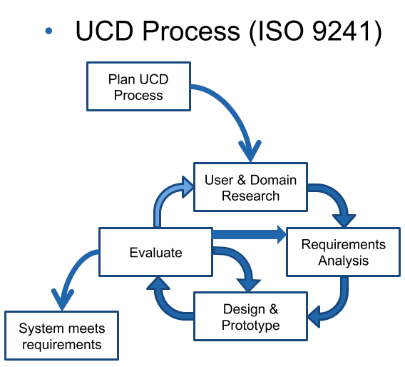

#### User & Domain Research

Methoden:

- Contextual Inquiry
- Interviews
- Beobachtung
- Fokusgruppen
- Umfragen
- Nutzungsauswertung
- Desktop Research
  - Dokumentenstudium
  - Mitbewerber

Artefakte:

- [Persona](#persona)
- [Usage-Szenario](#usage-szenario) (aktuelle Situation, Verwendung in User & Domain Research)
- [Kontextszenario](#kontextszenario) (zukünftige gewünschte Situation, Verwendung in Anforderungsanalyse des UCD)
- Mentales Modell
- [Domänenmodell](#domänenmodell)
- [Stakeholder Map](#stakeholder-map)
- Service Blueprint / Geschäftsprozessmodell

#### Persona

Eine **fiktive** Person, die in einer **bestimmten Rolle** eine **bestimmte Benutzergruppe repräsentiert**.

Wichtige Info:

- Name, Alter, Geschlecht, Herkunft
- Beruf, Ausbildung, Erfahrung
- Verantwortlichkeiten, Aufgaben, Persönliche Ziele
- 1-2 [Usage Szenarien](#usage-szenario)
- Haltungen, Aktivitäten, Einflüsse
- Fähigkeiten, Bedürfnisse
- Umgebung
- Pain Points und Frustrationen
- Erwartungen an neue Lösung
- Foto, Kernaussage

#### Szenarien

Inhalt:

- Motivation/Trigger
  - Was löst Szenario aus?
- Persona und ihre Ziele
  - Info, Artefakt, Emotion?
- Aktionen und Interaktionen
- Kontext
  - Wo findet Szenario statt?
  - Ändert der Kontext?
  - Wer/was ist sonst noch involviert
- Probleme, Ablenkungen
  - Welche und wie geht Persona damit um

##### Usage-Szenario

Beschreibt die aktuelle Situation:

- Wie Benutzer seinen Job mit der heutigen Lösung erledigt
- Zeigt allfällige Probleme, Workarounds (Pains) auf

##### Kontextszenario

Beschreibt die **zukünftige** gewünschte Situation **aus Benutzersicht**. High Level und **ohne Lösungskonzepte**. Beschreibt den Kontext für die [Use-Cases](#use-case-anwendungsfall-allgemein).

Beispiel:

Karin ist eine Kioskverkäuferin. Sie hat heute viele Kunden, aber zum Glück hat sie die neue Kasse «Swift» bekommen, mit der sie Produkte schnell einscannen kann. Kurz nachdem sie die Kasse eröffnet hat, trifft der erste Kunde ein. Er hat sich eine Tasse Kaffee am Automaten herausgelassen und zwei Gipfeli von der Selbstbedienungsauslage genommen: «Ein Kaffee crème und ein, nein zwei Gipfeli, und dann möchte ich noch die neuste NZZ.» Karin nimmt die neuste Ausgabe der NZZ vom Stapel und scannt den Barcode ein. Sofort registriert die Kasse 1x NZZ und zeigt der Preis von 5.60 Fr. an. Dann wählt Karin noch einen Kaffee Crème aus sowie Buttergipfeli und die Anzahl 2. Die Kasse registriert einen Kaffee Crème und zwei Buttergipfeli und listet alle Artikel mit der gewünschten Anzahl, dem Einzelpreis, sowie das Total pro Artikel auf und zeigt das Gesamttotal an. «Macht total 13.20 Fr, bitte» sagt Karin und gibt dem Kunden die NZZ und nimmt die 20 Fr.-Note des Kunden entgegen und tippt den bezahlten Betrag ein. Sofort zeigt die Kasse das auszuzahlende Rückgeld an. «20 Fr., dann erhalten sie hier 6.80 Fr. zurück. Vielen Dank und auf Wiedersehen». Karin gibt dem Kunden das Rückgeld zurück und schliesst gleichzeitig die Geldschublade der Kasse mit der anderen Hand. Dadurch wird der Einkauf abgeschlossen und Karin ist bereit für die nächste Kundin. Nach Ladenschluss macht Karin die Abrechnung. Die Kasse zeigt ihr die Gesamteinnahmen und wieviel Bargeld in der Kasse vorhanden sein müssten. Schnell zählt Karin das Bargeld und bestätigt, dass sich genau dieser Betrag in der Kasse befindet. Sie entnimmt der Kasse soviel Geld, dass nur wieder der
Anfangsbetrag in der Kasse verbleibt. Das entnommene Geld bringt sie gleich zur Bank.

#### Stakeholder-Map

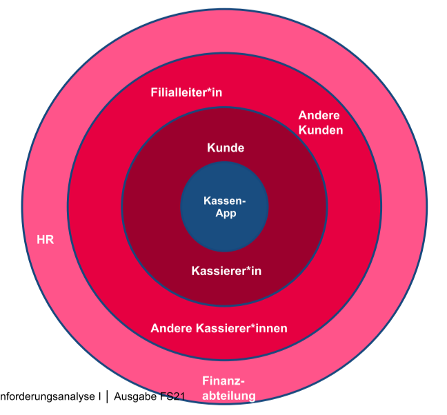

## Anforderungsanalyse II

### Use-Case (Anwendungsfall) allgemein

Textuelle Beschreibung einer konkreten Interaktion eines bestimmten Benutzers mit dem zukünftigen System.

- Aus Sicht des Akteurs
- Implizite und explizite Anforderungen
- Beschreiben das Ziel des Benutzers
- Beschreiben den Kontext
- Titel: Verb + evtl. Objekt vorangestellt (z.B. "Kasse eröffnen")
- **Immer im Aktiv schreiben**.

#### Primärakteur

Initiiert einen Anwendungsfall. Erhält den Hauptnutzen des Anwendungsfalls.

#### Unterstützender Akteur

Hilft dem SuD bei der Bearbeitung eines Anwendungsfalls.

#### Offstage-Akteur

Stakeholder, die nicht direkt mit dem System interagieren.

#### Tests

- Boss-Test: Was hast du den ganzen Tag gemacht?
  - Antwort: [Use-Case] ausgeführt
  - Reaktion: Boss zufrieden
- EBP-Test: Ist der Use-Case eine Aufgabe, welche als Reaktion auf ein Business-Event entstand?
- Size-Test: Hat der Use-Case mehr als eine einzelne Reaktion?

#### Use-Case finden

1. Systemgrenzen definieren
2. Primärakteure identifizieren
3. Jobs (Ziele, Aufgaben) der Primärakteure identifizieren

### Brief UC

- Titel + 1 Absatz
- Beschreibt Erfolgsszenario (keine Varianten oder Problemfälle)

Inhalt: Trigger des UCs, Akteure, summarischen Ablauf des UCs

> Beispiel:
>
> Kunde kommt mit seinen Waren zur Kasse. Kassier erfasst alle gekauften Produkte. Am Ende berechnet Kasse den Totalbetrag. Kassier zieht das Geld von Kunden ein und gibt den Betrag in die Kasse ein. Diese berechnet das Rückgeld. Kassier gibt Kunde
das berechnete Rückgeld zurück.

### Casual UC

- Titel + informelle Beschreibung in ein bis mehreren Absätzen
- Beschreibt auch wichtige Varianten

Inhalt: Trigger des UCs, Akteure, Interaktion des Akteurs mit System

> Beispiel:
>
> Der Gast eines Tisches verlangt die Rechnung. Die Servierperson versichert sich, dass alle Bestellwünsche ausgeliefert wurden und schliesst die Bestellung ab. Sie teilt dem Gast den zu zahlenden Gesamtbetrag des Tisches mit.
>
> **Falls** der Gast nicht einverstanden ist mit dem Gesamtbetrag, geht die Servierperson jede Bestellposition mit dem Gast durch.
>
> **Falls** mehrere Gäste an Bezahlung beteiligt sind, teilt die Servierperson den Gesamtbetrag wunschgemäss auf die beteiligten Personen auf. Die Servierperson teilt jedem zahlenden Gast des Tisches den zu bezahlenden Betrag mit. Die Servierperson markiert alle bezahlten Bestellpositionen als bezahlt.
>
> **Falls** ein Gast einen fixen Betrag bezahlen will, gibt sie diesen in die Bestellung ein. Das System reduziert den zu zahlenden Gesamtbetrag entsprechend.

### Fully-dressed UC

- Titel + alle Schritte und Varianten werden im Detail beschrieben
- Enthalten weitere Informationen zu Vorbedingungen, Erfolgsgarantien, etc.

Formaler Aufbau:

- UC-Name
- **(fakultativ)** Umfang (Scope)
  - Das SuD
- **(fakultativ)** Ebene (Level)
  - "Anwenderziel" oder "Subfunktion"
- Primärakteur (Primary Actor)
  - Initiiert den UC
  - Nutzniesser des UC
- **(fakultativ)** Stakeholders und Interessen
  - Nennung der Stakeholder und kurze Beschreibung ihrer Interessen
- Vorbedingungen (Preconditions)
  - Was ist die unmittelbare Voraussetzung, damit dieser UC
ablaufen kann?
- Erfolgsgarantie/Nachbedingungen (Success Guarantee)
  - Was muss nach der erfolgreichen Ausführung des UCs gewährleistet sein?
- Standardablauf (Main Sucess Scenario)
  - Beschreibt Interaktion des Primärakteurs mit dem System (und allenfalls unterstützenden Akteuren)
  - Startpunkt nach Vorbedingungen
- Erweiterungen (Extensions)
  - Beschreibt alternative Erfolgs- aber auch Misserfolgsszenarien
  - Referenzieren Standardablauf an entsprechender Stelle
- **(fakultativ)** Spezielle Anforderungen (Special Requirements)
- **(fakultativ)** Liste der Technik und Datavariationen (Technology and Data Variations)
  - Alternative I/O-Methoden, Datenformate, etc
- **(fakultativ)** Häufigkeit des Auftretens (Frequency of Occurance)
- **(fakultativ)** Verschiedenes (Miscellaneous)
  - Offene Fragen / Probleme

> Beispiel (Englisch):
>
> **Process Sale**
>
> **Primärakteur**: Cashier
>
> **Vorbedingungen**: Cashier is identified and authenticated.
>
> **Erfolgsgarantie**: Sale is saved. Tax is correctly calculated. Accounting and Inventory are updated. Commissions recorded. Receipt is generated. Payment authorization approvals are recorded.
>
> **Standardablauf**:
>
> 1. Customer arrives at POS checkout with goods and/or services to purchase.
> 2. Cashier starts a new sale.
> 3. Cashier enters item identifier.
> 4. System records sale line item and presents item description, price, and running total. Price calculated from a set of price rules.
> *Cashier repeats steps 3-4 until indicates done.*
> 5. System presents total with taxes calculated.
> 6. Cashier tells Customer the total, and asks for payment.
> 7. Customer pays and System handles payment.
> 8. System logs completed sale and sends sale and payment information to the external Accounting system (for accounting and commissions) and Inventory system (to update inventory).
> 9. System presents receipt.
> 10. Customer leaves with receipt and goods (if any).
>
> **Erweiterungen**:
>
> 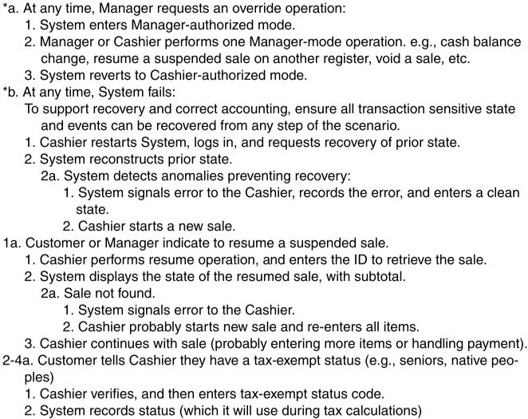

### Use-Case-Diagramm

- Primärakteure links
- Unterstützende Akteure rechts
- Keine Pfeile/Beschriftungen
- System(-grenze) als Kasten
- Use Cases als Ellipsen innerhalb Systemgrenze

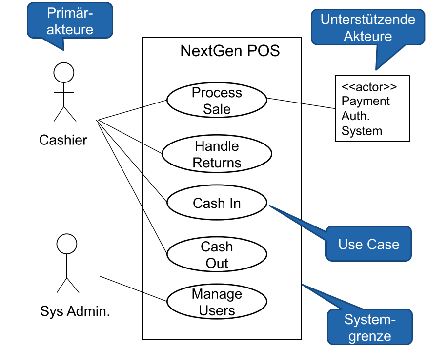

### SSD

Ist formal ein UML-Sequenzdiagramm. Zeigt Interaktionen der Akteure mit dem System.

- Welche Input-Events auf das System einwirken
- Welche Output-Events das System erzeugt

Ziel: Wichtigste [Systemoperationen](#systemoperation) identifizieren.

Beispiel:

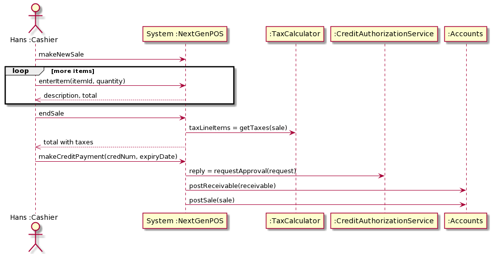

- Links ist Primärakteur
- Mitte das System
- Rechts sind Sekundärakteure, falls nötig
- Durchzogener Pfeil für Methodenaufruf (Systemoperation)
- Gestrichelte Linie mit offenem Pfeil für Rückgabewert (kann fehlen, falls unwichtig)

### Systemoperation

Formal wie ein Methodenaufruf mit allfälligen Parametern. Eine Systemoperation kann mit einem [Operation Contract](#operation-contract) noch genauer spezifiziert werden.

### Operation Contract

Setzt man ein, wenn aus einem Anwendungsfall nicht klar wird, was [Systemoperation](#systemoperation) genau machen muss. Also nur bei sehr komplizierten Operationen und/oder wenn die Entwicklung der Systemoperation ausgelagert wird.

- Name plus Parameterliste
- Vorbedingung(en)
  - Was muss zwingend erfüllt sein, damit Systemoperation aufgerufen werden kann
- Nachbedingung(en)
  - Was hat sich alles geändert im System nach Ausführung der Systemoperation
    - Erstellte/gelöschte Instanzen, Assoziationen
    - Geänderte Attribute
- Basiert auf Domänenmodell

Beispiel:

[Systemoperation](#systemoperation): enterItem(idemId: ItemId, quantity: integer)

Vorbedingung:

- Verkauf muss gestartet sein

Nachbedingungen:

- SaleLineItem-Instanz sli erstellt
- sli mit aktueller Sale-Instanz verknüpft
- sli.quantity auf quantity gesetzt
- sli mit entsprechender ProductDescription
verknüpft (gemäss itemID)

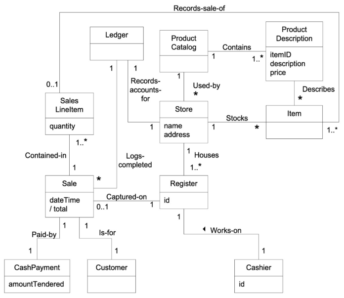

### Weitere Anforderungen (FURPS+)

Es gibt auch funktionale und nicht-funktionale Anforderungen, die nicht von den UCs beschrieben werden.

TODO?

### Glossar

> Beispiel:
>
>- Bestellwunsch: Ein einzelner Bestellwunsch eines Gastes (Menu, Getränk, etc.)
>- Bestellposition: Ein einzelner Eintrag einer Teilbestellung. Kann ein Menu, ein Getränk, Tabakware, etc. sein, zusammen mit der Anzahl desselben Bestellwunsches
>- Bestellung: Gesamte Bestellung eines Tisches, bestehend aus mind. einer Teilbestellung
>- Teilbestellung: Teilbestellung eines Tisches, die zu einem bestimmten Zeitpunkt aufgegeben
wird

## Domänenmodellierung

> Beispiel:
>
>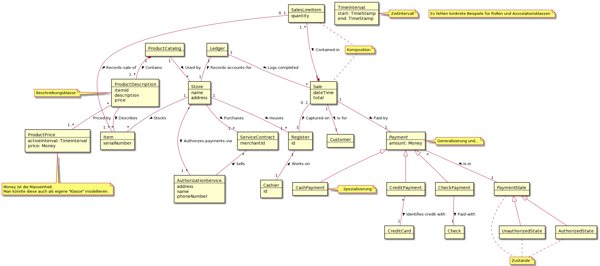

## Softwarearchitektur und Design I

TODO

### Nichtfunktionale Anforderungen

TODO

### Paketdiagramm

> Beispiel:
>
> 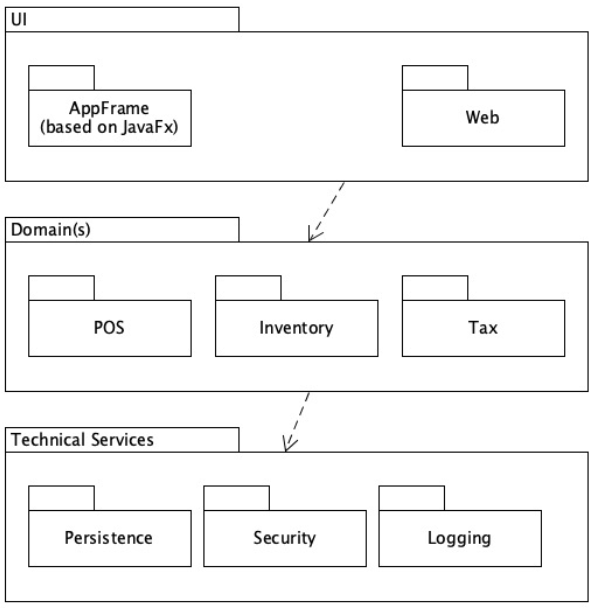

### Verteilungsdiagramm

TODO in UMLet (PlantUML unterstützt die im Cheat Sheet geforderte Notation nicht wirklich.)

### Layered Pattern

- Strukturierung eines Programms in Schichten
- Je weiter unten, desto allgemeiner
- Je höher, desto anwendungs-spezifischer
- Zuoberst ist das Benutzerinterface
- **Kopplung nur von oben nach unten**, NIE von unten nach oben

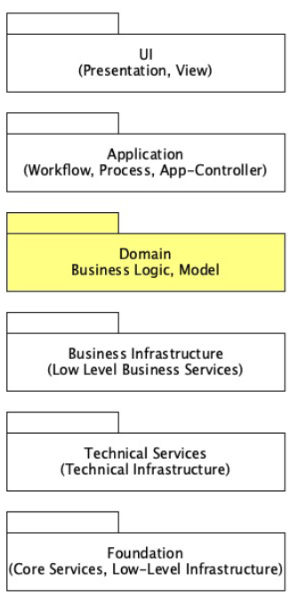

### Client-Server Pattern

- Ein Server stellt Services für mehrere Clients zur Verfügung
- Client: Request
- Server: Response

### Master-Slave Pattern

- Der Master verteilt die Aufgaben auf mehrere Slaves
- Die Slaves führen die Berechnung aus und senden das Ergebnis zum Master
- Der Master berechnet das Endergebnis

### Pipe-Filter Pattern

- Das Pattern kommt bei der Verarbeitung von Datenströmen zum Einsatz (z.B. Java Streams)
- Jeder Verarbeitungsschritt wird durch einen Operator wie Filter, Mapper, etc. umgesetzt

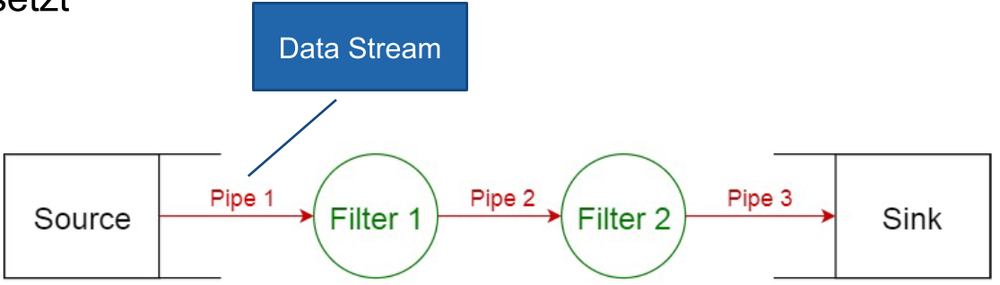

### Broker Pattern

- Das Pattern wird eingesetzt, um verteilte Systeme mit entkoppelten Subsystemen zu koordinieren.
- Der Broker (Vermittler) vermittelt die Kommunikation zwischen einem Client und dem entsprechenden Subsystem
- Bsp.: Message Broker

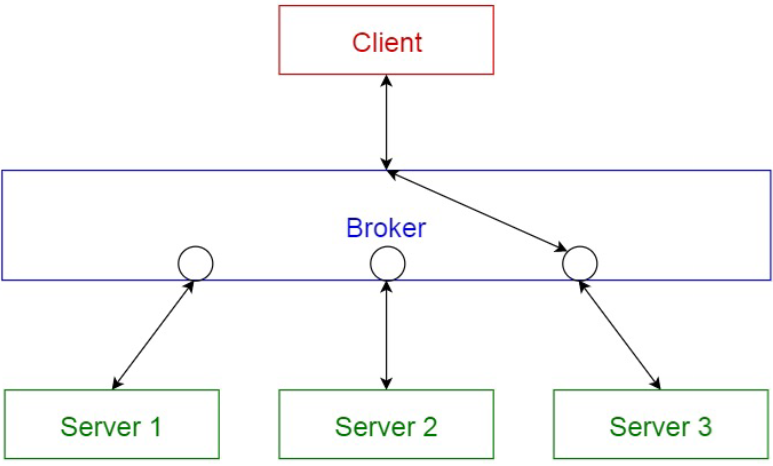

### Event-Bus Pattern

- Der Pattern umfasst vier Hauptkomponenten: **EventSource**, **EventListener**, **Channel** und **EventBus**.
- Die Event Sources publizieren Meldungen zu einem bestimmten Kanal auf dem Event Bus
- EventListeners
  - Melden sich für bestimmte Events an
  - werden informiert, sobald sich entsprechende Meldungen auf dem Kanal befinden

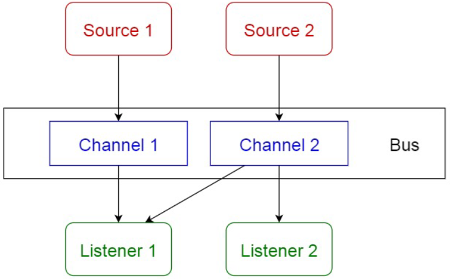

### MVC Pattern

- Eine interaktive Anwendung wird in drei Komponenten aufgeteilt:
  - Model: Daten und Logik,
  - View: Informationsanzeige
  - Controller: Verarbeitung der Benutzereingabe
- Bewirkt eine Entkopplung von UI und Logik
- Erlaubt Austauschbarkeit des UIs
- Alternativen:
  - MVVM: Model View ViewModel
  - MVP: Model View Presenter

## Softwarearchitektur und Design II

TODO

### UML-Klassendiagramm

TODO

### UML-Sequenzdiagramm

TODO

### UML-Kommunikationsdiagramm

TODO

### UML-Zustandsdiagramm

TODO

### UML-Aktivitätsdiagramm

TODO

### GRASP

9 Prinzipien bzw. Pattern

GRASP legt die Zuständigkeit bestimmter Klassen objektorientierter Systeme fest. Es sind sehr grundlegende Prinzipien bzw. Pattern.

#### Information Expert

- __Problem__: _Grundlegendes Konzept Verantwortlichkeiten zuzuweisen_
- __Lösung__: Verantwortlichkeiten sollen einer Klasse zugewiesen werden, die über die Informationen verfügt, um sie zu erfüllen.

#### Creator

- __Problem__: _Wer soll dafür Verantwortlich sein eine Instanz einer Klasse zu erzeugen?_
- __Lösung__: Weisen Sie einer Klasse A die Verantwortlichkeit zu, eine Instanz der Klasse B zu erstellen, wenn eine oder mehrere (je mehr desto besser) der folgenden Aussagen wahr sind:
  - A ist eine Aggregation oder Kompositum von B
  - A registriert oder erfasst B-Objekte
  - A arbeitet eng mit B-Objekten zusammen oder hat eine enge Kopplung
  - A verfügt über Initialisierungsdaten für B

#### Controller

- __Problem__: _Welches erste Objekt jenseits der UI-Schicht empfängt und koordiniert eine Systemoperation?_
- __Lösung__: Weisen Sie die Verantwortlichkeit einer Klasse zu, die eine der folgenden Bedingungen erfüllt:
  - __Fassaden Controller__: Repränsentiert das "Root-Objekt", System bzw. übergeordnetes System auf dem die Software läuft
  - __Use Case Controller__: Pro Use-Case-Szenario eine "künstliche" Klasse, in der die Systemoperation abläuft.

#### Low Coupling

- __Problem__: _Wie erreicht man eine geringe Abhängigkeit und wie begrenzt man die Auswirkungen von Änderungen und wie verbessert man die Wiederverwendbarkeit?_

- __Lösung__: Die Verantwortlichkeiten sollen so zugewiesen werden, dass die Kopplung gering bleibt.

#### High Cohesion

- __Problem__: _Wie kann erreicht werden, dass Objekte fokussiert, verständlich und handhabbar bleiben und nebenbei Low Coupling unterstüzten?_
- __Lösung__: Die Verantwortlichkeiten sollen so zugewiesen werden, dass die Kohäsion hoch bleibt.

#### Polymorphism

- __Problem__: _Wie werden typabhängige Alternativen gehandhabt?_
- __Lösung__: Weisen Sie das typenabhängige Verhalten mit polymorphen Operationen der Klasse zu, dessen Verhalten variiert. Das typenabhängige Verhalten wird mit polymorphen Operationen der Klassen variiert.

#### Pure Fabrication

- __Problem__: _Welche Objekte sollen die Verantwortlichkeit haben, wenn Sie nicht gegen High Cohesion und Low Coupling oder andere Ziele verstossen wollen, aber die Lösungen, die beispielsweise vom Information Expert vorgeschlagen werden, nicht passen?_
- __Lösung__: Eine künstliche Hilfsklasse wird erstellt, welche diese Verantwortlichkeiten übernehmen kann.

#### Indirection

- __Problem__: _Wie soll eine Verantwortlichkeit zugewiesen werden, um eine direkte Kopplung zwischen zwei oder mehr Objekten zu vermeiden? Wie können Objekte entkoppelt werden, so dass die Kopplung geringer und das Wiederverwendbarkeitspotential grösser wird?_
- __Lösung__: Die Verantwortlichkeiten werden einem zwischengeschalteten Objekt zugewiesen, das zwischen den anderen Komponenten oder Diensten vermittelt, so dass diese nicht direkt gekoppelt sind.

#### Protected Variations

- __Problem__: _Wie sollen Objekte, Subsysteme und Systeme entworfen werden, sodass Veränderungen und Instabiliäten in diesen Elementen keinen Einfluss auf andere Elemente haben?_
- __Lösung__: Identifizieren Sie die Punkte, an denen Veränderungen und Instabilitäten erwartet werden. Weisen Sie Verantwortlichkeiten so zu, dass diese Punkte durch ein stabiles Interface eingekapselt werden.

## Implementation, Refactoring und Testing

### Design to Code

Es soll aus den vorhandenen Design-Artefakten der Quellcode abgeleitet werden.

#### Variante Bottom-Up Strategie

- Falls alle umzusetzenden Klassen als Design Artefakte vorhanden sind, kann eine Bottom-Up Strategie gewählt werden.

#### Variante Agile

- Im agilen Umfeld werden Funktionen **Schritt für Schritt** umgesetzt. Es sind **nur die für die Iteration notwendigen Klassen bekannt**.
- Vorhandene Klassen müssen angepasst (refaktoriert) werden.
- Die Umsetzung wird über die verschiedenen Schichten der Architektur vollzogen wie Model, Controller, Services, Repository.
- Ausgangspunkt ist oft eine Schnittstellenbeschreibung:
  - Benutzerschnittstelle (von UX-Desiger)
  - Systemschnittstelle (z.B. OpenApi Swagger)

### Implementation

Implementierungsstrategien:

- Code-Driven Development
  - Zuerst die Klasse implementieren
- TDD: Test-Driven Development
  - Zuerst Tests für Klassen/Komponenten schreiben, dann den Code entwickeln
- BDD: Behavior-Driven Development
  - Tests aus Benutzersicht beschreiben
  - Zum Beispiel durch die Business Analysten mit Hilfe von Gherkin

### Refactoring

- Strukturierte, disziplinierte Methode, vorhandenen Code umzuschreiben
- Externes Verhalten bleibt gleich!
- Viele kleine Schritte (Codeänderungen)
- Interne Struktur wird verbessert.
  - Um Erweiterungen einzuleiten
- Trennen von der eigentlichen Weiterentwicklung!
- Low Level Design
  - Programmiertechnik

Code verbessern...:

- DRY: Keinen duplizierten Code
- Namensgebung: Klarheit erhöhen, Aussagekräftige Namen
- Lange Methoden verkürzen (kein Spaghetti-Code -> neue Methoden)
- Algorithmen strukturieren in
  - Initialisierung
  - Berechnung
  - Aufbereiten des Resultats
- Sichtbarkeit verbessern
- Testbarkeit verbessern

**Code Smells**:

- Duplizierter Code
- Lange Methoden
- Klassen mit vielen Instanzvariablen
- Klassen mit sehr viel Code
- Auffällig ähnliche Unterklassen
- Keine Interfaces, nur Klassen
- Hohe Kopplung zwischen Klassen

#### Refactoring Patterns

- Rename Method / Class / Variable
  - Eine Methode/Klasse/Variable wird so umbenannt, dass sie einen aussagekräftigen Namen erhält.
- Pull Up / Push Down
  - Eine Methode wird in eine Superklasse / Subklasse verschoben.
- Extract Interface / Superclass
  - Ein Teil eines bestehenden Interfaces / Klasse wird in eine Superinterface / Superklasse extrahiert.
- Extract Method
  - Teil einer Methode in eine private Methode auslagern.
- Extract Constant
  - Symbolische Konstante verwenden.
- Introduce Explaining Variable
  - Grossen Ausdruck aufteilen, erklärende Zwischenvariablen einfügen.

### Testing

Grundlegende Testarten:

- Funktionaler Test (Black-Box Verfahren)
- Nicht funktionaler Test (Lasttest etc.)
- Strukturbezogener Test (White-Box Verfahren)
- Änderungsbezogener Test (Regressionstest etc.)

#### Integrationstest

- Eine Klasse wird im Anwendungskontext eingesetzt
- Es werden nun **keine Mockups**, sondern die richtigen referenzierten Klassen eingesetzt
- Typischerweise wird dann ein **ganzes Subsystem**, vielleicht auch das ganze System, getestet
- **Black-Box-Test**, mit zusätzlichem Wissen über Internas

#### Systemtest

- Das **ganze System** oder die gesamte Anwendungslogik wird getestet
- Typischerweise ein **Black-Box-Test**
- Wird nicht nur während der Entwicklung, sondern auch vor einer Auslieferung an den Kunden durchgeführt
- **Anwendungsfälle beiziehen**

#### Abnahmetest

- **Nach der Auslieferung** wird die gesamte Software **vom Kunden** getestet
- Meist ein Systemtest **über das UI**
- **Reiner Black-Box-Test**
- Orientiert sich an den Anforderungen des Kunden (was er für wichtig hält)
- Oft relevant für die Bezahlung

#### Regressionstest

- Automatische Wiederholung von Tests nach Veränderungen am Quelltext
  - Von Vorteil, wenn diese Tests ebenfalls als ausführbarer Code vorliegen
- Nach Refactoring Tätigkeiten
- Nach Weiterentwicklung für die Funktionen, die nicht geändert haben

## GoF (1 - Creational)

[View Patterns Online](https://refactoring.guru/design-patterns/catalog)

### Simple Factory

- __Problem__: Das Erzeugen eines neuen Objekts ist aufwändig.
- __Lösung__: Eine eigene Klasse für das Erzeugen eines neuen Objekts wird erstellt.
- __Anwendung__:

### Abstract Factory

- __Problem__: Die Erzeugung verschiedener, inhaltlich zusammgehörender Objekte, ohne aber die konkreten Klassen zu kennen, damit diese austauschbar sind.
- __Lösung__: Eine AbstractFactory und abstrakte Produkte definieren. Die AbstractFactory hat für jedes Produkt eine eigene "create" Methode. Eine konkrete Factory davon ableiten, die dann konkrete Produkte erzeugt.
- __Anwendung__:

### Factory Method

- __Problem__: Eine (wiederverwendbare) Klasse Creator hat die Verantwortlichkeit, eine Instanz der Klasse Product zu erzeugen. Es ist aber klar, dass Product noch spezialisiert werden muss.
- __Lösung__: Eine abstrakte Methode in der Klasse Creator definieren, die als Resultat Product zurückliefert. Konkrete Klassen von Creator können dann die richtige Subklasse von Product erzeugen.
- __Anwendung__:

### Singleton

- __Problem__: Man benötigt nur genau eine (globale) Instanz einer Klasse.
- __Lösung__: Eine Klasse mit einer (public) statischen Methode die immer dasselbe Objekt zurückliefert.
- __Anwendung__:

## GoF (2 - Structural)

### Adapter

- __Problem__: Eine Klasse, die mit einem bereits definierten domänenspezifischem Interface inkompatibel ist, soll eingesetzt werden.
- __Lösung__: Eine eigene Adapter Klasse wird dazwischengeschaltet.
- __Anwendung__:

### Dependency Injection

- __Problem__: Eine Klasse braucht eine Referenz auf ein anderes Objekt. Dieses Objekt muss ein bestimmtes Interface definieren, je nach Konfiguration aber mit einer anderen Funktionalität.
- __Lösung__: Anstelle, dass die Klasse abhängige Objekte selber erzeugt, wird dieses Objekt von aussen gesetzt.
- __Anwendung__:

### Composite

- __Problem__: Eine Menge von Objekten haben dasselbe Interface und müssen für viele Verantwortlichkeiten als Gesamtheit betrachtet werden.
- __Lösung__: Sie definieren ein Composite, das ebenfalls dasselbe Interface implementiert und Methoden an die darin enthaltenen Objekte weiterleitet.
- __Anwendung__:

### Decorator

- __Problem__: Ein Objekt soll mit zusätzlichen Verantwortlichkeiten versehen werden.
- __Lösung__: Ein Decorator, der dieselbe Schnittstelle hat wie das ursprüngliche Objekt, wird vor dieses geschaltet. Der Decorator kann nun jeden Methodenaufruf entweder selber bearbeiten, ihn weiterleiten oder eine Mischung von beidem.
- __Anwendung__:

### Facade

- __Problem__: Sie setzen ein ziemlich kompliziertes Subsystem mit vielen Klassen ein. Wie können Sie seine Verwendung so vereinfachen, dass alle Team-Mitglieder es korrekt und einfach verwenden können?
- __Lösung__: Eien Facade Klasse wird definiert, welche eine vereinfachte Schnittstelle zum Subsystem anbietet und die meisten Anwendunge abdeckt.
- __Anwendung__:

### Proxy

- __Problem__: Ein Objekt ist (noch) nicht im selben Adressraum verfügbar. 
- __Lösung__: Ein Stellvertreter Objekt ("Proxy") mit demselben Interface wird anstelle des richtigen Objekts verwendet. Das "Proxy" Objekt leitet alle Methodenaufrufe zum richtigen Objekt weiter.
- __Anwendung__:

## GoF (3 - Behavioural)

### Chain of Responsibility

- __Problem__: Für eine Anfrage gibt es potentiell mehrere Handler, aber von vornherein ist es nicht möglich, den richtigen Handler herauszufinden.
- __Lösung__: Die Handler werden in einer einfach verketteten Liste hintereinandergeschaltet. Jeder Handler entscheidet dann, ob er die Anfrage selber beantworten möchte oder sie an den nächsten Handler weiterleitet.
- __Anwendung__:

### Observer

- __Problem__: Ein Objekt soll ein anderes benachrichtigen, ohne dass es den genauen Typ des Empfängers kennt.
- __Lösung__: Ein Interface wird definiert, das nur dazu dient, ein Objekt über eine Änderung zu informieren. Dieses Interface wird vom "Observer" implementiert. Das "Observable" Objekt benachrichtigt alle registrierten "Observer" über eine Änderung.
- __Anwendung__:

### State

- __Problem__: Das Verhalten eines Objekt ist abhängig von seinem inneren Zustand.
- __Lösung__: Das Objekt hat ein darin enthaltenes Zustandsobjekt. Alle Methoden deren Verhalten vom Zustand abhängig sind, werden über das Zustandsobjekt geführt.
- __Anwendung__:

### Strategy

- __Problem__: Ein Algorithmus soll einfach austauschbar sein.
- __Lösung__: Den Algorithmus in eine eigene Klasse verschieben, die nur eine Methode mit diesem Algorithmus hat. Ein Interface für diese Klasse definieren, dass von alternativen Algorithmen implementiert werden muss.
- __Anwendung__:

### Template Method

- __Problem__: Ein Ablauf / Algorithmus soll entworfen werden, dass er in gewissen Punkten angepasst werden kann.
- __Lösung__: In einer abstrakten Klasse wird eine Template Methode hinzugefügt, die diesen Ablauf implementiert. Die Template Methode ist soweit fertig geschrieben, ruft aber noch abstrakte Methoden auf. Diese Methoden dienen als Variations- resp. Erweiterungspunkte und mit ihrer Implementation kann der Ablauf auf den aktuellen Kontext angepasst werden.
- __Anwendung__:

### Visitor

- __Problem__: Eine Klassenhierarchie soll um (weniger wichtige) Verantwortlichkeiten erweitert werden, ohne dass viele neue Methoden hinzukommen.
- __Lösung__: Die Klassenhierarchie wird mit einer Visitor-Infrastruktur erweitert. Alle weiteren neuen Verantwortlichkeiten werden dann mit spezifischen Visitor-Klassen realisiert.
- __Anwendung__:

### Command

- __Problem__: Aktionen müssen für einen späteren Gebraucht gespeichert werden und dabei können sie noch allenfalls priorisiert oder protokolliert werden und / oder Unterstützung für ein Undo anbieten.
- __Lösung__: Ein Interface wird definiert, das nur die Auslösung der Aktion erlaubt. Implementationen dieses Interface überschreiben die Methode zur Auslösung der Aktion. Meistens bedeutet die Aktion, dass eine Methode auf einem anderen Objekt aufgerufen wird. Dazu muss die Aktion die Parameter dieser Methode zwischenspeichern.
- __Anwendung__:
