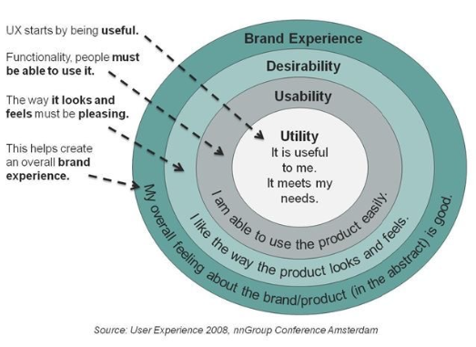

# 1. SWEN1 - Zusammenfassung

- [1. SWEN1 - Zusammenfassung](#1-swen1---zusammenfassung)
  - [1.1. Prozesse](#11-prozesse)
    - [1.1.1. Code & Fix](#111-code--fix)
    - [1.1.2. Wasserfall](#112-wasserfall)
    - [1.1.3. Iterativ-inkrementelle](#113-iterativ-inkrementelle)
    - [1.1.4. Agile](#114-agile)
    - [1.1.5. Prozesskontrolle](#115-prozesskontrolle)
  - [1.2. Anforderungsanalyse](#12-anforderungsanalyse)
    - [1.2.1. Usability and User Experience](#121-usability-and-user-experience)
  - [1.3. Kontextszenario](#13-kontextszenario)
  - [1.4. Use-cases](#14-use-cases)
    - [1.4.1. Fully Dressed UC](#141-fully-dressed-uc)
    - [1.4.2. FURPS+](#142-furps)
    - [1.4.3. Systemsequenzdiagramm](#143-systemsequenzdiagramm)
    - [1.4.4. Operation Contract](#144-operation-contract)
  - [1.5. Domänenmodellierung](#15-domänenmodellierung)
    - [1.5.1. Komposition](#151-komposition)
    - [1.5.2. Aggregation](#152-aggregation)
  - [1.6. Paketdiagramm](#16-paketdiagramm)
  - [1.7. Softwarearchitektur und Design](#17-softwarearchitektur-und-design)
  - [1.8. Implementation, Refactoring und Testing](#18-implementation-refactoring-und-testing)
  - [1.9. Entwurf mit Design Patterns](#19-entwurf-mit-design-patterns)
  - [1.10. Vertiefungen](#110-vertiefungen)
    - [1.10.1. Verteilte Systeme](#1101-verteilte-systeme)
    - [1.10.2. GUI Architekturen](#1102-gui-architekturen)
    - [1.10.3. Persistenz](#1103-persistenz)
    - [1.10.4. Framework Design](#1104-framework-design)

## 1.1. Prozesse

### 1.1.1. Code & Fix

|                |                                                                              |
| -------------- | ---------------------------------------------------------------------------- |
| **Definition** | Nur Codierung oder Korrektur in der Entwicklung.                             |
| **Annahme**    | Erstens kommt es anders und zweitens als man denkt!                          |
| **Vorteile**   | Schnell & Einfach                                                            |
| **Nachteil**   | Nicht planbar, aufwand für Korrekturen unangemessen hoch & schlecht wartbar. |

### 1.1.2. Wasserfall

|                |                                                                                        |
| -------------- | -------------------------------------------------------------------------------------- |
| **Definition** | Folge von Phasen, die durch Teilergebnisse gekoppelt sind. Reihenfolge ist vorgegeben. |
| **Annahme**    | Ziel ist früh bestimmbar.                                                              |
| **Vorteile**   | Hohe Planbarkeit, Klare Aufteilung der Entwicklung in Phasen.                          |
| **Nachteil**   | Schlechtes Risikomanagement, Anforderungen sind zu Beginn nie komplett.                |

### 1.1.3. Iterativ-inkrementelle

|                |                                                                                         |
| -------------- | --------------------------------------------------------------------------------------- |
| **Definition** | Software in mehreren Iterationen inkrementell entwickelt.                               |
| **Annahme**    | Ziel und Gelände sind konstant, aber am Anfang unklar.                                  |
| **Vorteile**   | Flexibel, gutes Risikomanagement & Frühe Einsetzbarkeit der Software                    |
| **Nachteil**   | Planbarkeit hat Grenzen, Involvierung und Steuerung durch den Kunden im ganzen Projekt. |

> **Wichtig!** Artefakte entstehen inkrementell

- **Anforderungsanalyse**
  - Funktionale Anforderungen mit Use Cases (Funktionale Anforderungen)
  - Qualitätsanforderungen und Randbedingungen (Nicht-funktionale Anforderungen)
  - Domänenmodell
- **Design**
  - Architektur
  - Use Case Realisierung
- **Implementation**
  - Quellcode
- **Testing**
  - Unit-Tests
  - Integrations- und Systemtests

### 1.1.4. Agile

Ist eine Sammlung von Ideen (Werte, Prinzipien und Praktiken), um den iterativ-inkrementellen Softwareentwicklungsprozess flexibler und schlanker zu machen.

|                |                                                                                |
| -------------- | ------------------------------------------------------------------------------ |
| **Definition** | Basiert auf Iterativ-inkrementellem Model. Weniger Dokumentation.              |
| **Annahme**    | Ziel und Gelände sind konstant, aber am Anfang unklar.                         |
| **Vorteile**   | Sehr Flexibel.                                                                 |
| **Nachteil**   | Planung schwierig bis unmöglich, solange Problem nicht im Detail bekannt sind. |

### 1.1.5. Prozesskontrolle

- Plan-driven
  - Planung wird am Anfang durchgeführt, dann Prozess gesteuert und überwacht.
  - Geeignet für gut planbare Problemstellungen.
  - Strategie: Steuerung
- Agile
  - Nur Grobplanung am Anfang
  - Prozess wird fortlaufend überwacht
  - Rollende Planung
  - Geeignet für komplexe Problemstellungen (unbekannte Anforderung)
  - Strategie: Regelung, Deming-Cycle (Plan-Do-Check-Act)

## 1.2. Anforderungsanalyse

### 1.2.1. Usability and User Experience

- DIN EN ISO 9241-110
- Usability Engineering
- Effektivität, Effizienz, Zufriedenheit
- User Centered Design
  - Personas
  - Usage-Szenarien
  - Mentales Modell
  - Stakeholder Map
  - Service Blueprint
  - Domänenmodell

## 1.3. Kontextszenario

> **Wichtig!** unterscheidet sich von Usage-Szenario. Dieses beschreibt die aktuelle Situation.

- **Persona festlegen**
  – Name, Alter, Geschlecht, Herkunft
  – Beruf, Ausbildung, Erfahrung
  – Verantwortlichkeiten,Aufgaben, Persönliche Ziele
  – 1-2 Usage Szenarien
  – Haltungen, Aktivitäten, Einflüsse
  – Fähigkeiten, Bedürfnisse
  – Umgebung
  – Pain Points und Frustrationen
  – Erwartungen an neue Lösung
  – Foto, Kernaussage
- **Szenario beschreiben**
  - Möglichst genau beschreiben wie die Zukunft aussehen soll
  - Nicht direkt auf die Lösung eingehen
  - Aus der Sicht von der beschriebenenPersona

## 1.4. Use-cases

Anwendungsfälle (Use-cases) werden aus dem Kontextszenario abgeleitet.
Ein Use-case enthält folgende Informationen:

- Muss einen konkreten **Nutzen für den Akteur** erzeugen
- Eine **Handlung**, die eine **Person**, an einem **Ort** zu einer **Zeit** mit dem **System** ausführt
- Sollte **mehr als eine einzelne Interaktion** umfassen

Das Use-case Diagram zeigt:

- Systemabgrenzung
- Akteure
  - Primärakteure **initiieren** einen UC
  - Unterstützende Akteure **sind beteiligt** an einem UC
- Lister der Anwendungsfälle

Folgende Regeln sollten beachtet werden:

1. Primärakteuere (links)
2. Unterstützende Akteure (rechts)
3. Keine Pfeile
4. System als Kasten

Es gibt drei verschiedene Typen von Use-cases:

1. Brief UC (Kurz)
   1. Title + 1 Absatz
   2. Beschreibt Standardablauf
   3. Enthält
      1. Trigger
      2. Akteure
      3. Summarischen Ablauf
2. Casual UC (Informell)
   1. Titel + informelle Beschreibung
   2. Beschreibt wichtige Varianten
   3. Enthält
      1. Trigger
      2. Akteure
      3. Interaktion des Akteurs mit System
3. Fully dressed UC (Vollständig)
   1. Titel + alle Schritte und Varianten werden im Detail beschrieben
   2. Enthalten weitere Informationen zu Vorbedingungen, Erfolgsgarantien, etc.

### 1.4.1. Fully Dressed UC

Der Fully-dressed UC ist wie folgt aufgebaut:

- **UC-Name**
- **Umfang (Scope)**
  - Beschreibt das zu entwickelnde System
- **Ebene (Level)**
  - Anwenderziel oder Subfunktion
- **Primärakteur (PrimaryActor)**
- **Stakeholders und Interessen**
  - Für wen ist der UC sonst noch relevant?
- **Vorbedingungen (Preconditions)**
- **Nachbedingungen (Success Guarantee)**
- **Standardablauf (Main Success Scenario)**
  - Wichtigster Teil des UCs
  - Nummeriert: `[0-9]*`
- **Erweiterungen (Extensions)**
  - Alternative Erfolgs- aber auch Misserfolgsszenarien
  - Nummeriert: `[0-9]*[a-z]` (bsp. 3a)
  - Falls eine Erweiterung jeder Zeit auftreten kann wird er mit einem Stern markiert: `\*[a-z]` (bsp. *a)
- **Spezielle Anforderungen (Special Requirements)**
- **Liste der Technik und Datavariationen (Technology and Data Variations)**
  - Alternative I/O-Methoden, Datenformate, etc
- **Häufigkeit des Auftretens (Frequency of Occurrence)**
- **Verschiedenes (Miscellaneous)**
  - Offene Frage / Probleme

### 1.4.2. FURPS+

- Functionality
- Usability
- Reliability
- Performance
- Supportability
- +
  - Implementation
  - Interface
  - Operation
  - Packaging
  - Legal

### 1.4.3. Systemsequenzdiagramm

Ein SSD zeigt die Interaktion der Akteure mit dem System.

### 1.4.4. Operation Contract

Eine Operation kann mit einem Vertrag noch genauer spezifiziert werden:

- Name plus Parameterliste
- Vorbedingung
- Nachbedingung

**Beispiel:**

- **Operation**: `enterItem(idemID: ItemID, quantity: integer)`
- **Vorbedingungen**:
  - Verkauf muss gestartet sein
**Nachbedingungen**:
  - `SaleLineItem`-Instanz `sli` ist erstellt.
  - `sli` mit aktueller Sale-Instanz verknüpft
  - `sli.quantity` auf quantity gesetzt
  - `sli` mit entsprechender `ProductDescription` verknüpft gemäss `itemID`

## 1.5. Domänenmodellierung

Vereinfachtes Klassendiagramm.

> **Achtung!**
> - Keine Funktionen
> - Keine Lösungen

### 1.5.1. Komposition
Das `SaleLineItem` kann ohne `Sale` nicht existieren. Wird das `Sale` Objekt gelöscht so wird das `SaleLineItem` auch gelöscht.

### 1.5.2. Aggregation

Im Gegensatz zur Komposition hat die Aggregation keine echte Semantik. Sie wird als "hat" Beziehung beschrieben.

## 1.6. Paketdiagramm

Zeigt den Aufbau der Applikation oberflächlich auf.

## 1.7. Softwarearchitektur und Design

## 1.8. Implementation, Refactoring und Testing

## 1.9. Entwurf mit Design Patterns

## 1.10. Vertiefungen

### 1.10.1. Verteilte Systeme

Data Transfer Object (DTO) ist ein Design Pattern, das verwendet wird für den Datenaustausch zwischen Client und Server. 

### 1.10.2. GUI Architekturen
### 1.10.3. Persistenz

Für eine Persistenz-Strategie muss eine Entscheidung getroffen werden, wo die Zuordnung (Mapping) zwischen Objekten und Tabellen stattfinden soll:

- Active Record (Anti Pattern): Jede Entität ist selber dafür zuständig
- Data Access Object (DAO): Abstrahiert und kapselt den Zugriff auf die Datenquelle
- O/R Data Mapper: Separate Klasse für das Mapping oder Einsatz eines ORM

O/R Mapper Pattern

- DAO (Data Access Object) ohne ein ORM (Object Relational Mapper)
- Umsetzung von DAO mit Hilfe von JPA (Java Persistence API)

### 1.10.4. Framework Design

## Diagramme

### UML-Klassendiagramm

_Aus welchen Klassen besteht mein System und wie sind diese miteinander verknüpft?_

Beschreibt die statische Struktur des zu entwerfenden oder abzubildenden Systems. Es bildet die Brücke zwischen dynamischen Diagrammen.

### UML-Sequenzdiagramm (Interaktionsdiagramm)

_Wer tauscht mit wem welche Informationen in welcher Reihenfolge aus?_

Stellt den zeitlichen Ablauf des Informationsaustausches zwischen Kommunikationspartnern dar.

Kann als Systemsequenzdiagramm (SSD) oder zur Darstellung von Interaktionen und Kollaborationen zwischen Objekten zur Realisierung eines konkreten Use-Case-Szenarios.

### UML-Kommunikationsdiagramm (Interaktionsdiagramm)

_Wer kommuniziert mit wem? Wer arbeitet im System zusammen?_

Stellt den Informationsaustausch zwischen Kommunikationspartnern dar. Der Überblick steht hier im Vordergrund.

### Zustandsdiagramm

_Welche Zustände kann ein Objekt, eine Schnittstelle, ein Use Case, ... bei welchen Ereignissen annehmen._

Präzise Abbildung eines Zustandsmodells mit Zuständen, Ereignissen, Nebenläufigkeiten, Bedingungen, Ein- und Austrittsaktionen.

Wird vor allem in der Modellierung von Echtzeitsystemen, Steuerungen und Protokollen verwendet.

### Aktivitätsdiagramm

_Wie läuft ein bestimmter Prozess oder ein Algorithmus ab?_

Detaillierte Visualisierung von Abläufen mit Bedingungen, Schleifen und Verzweigungen.

### Systemkontext-Diagramm

### Use Case Diagramm

### Domänenmodell

### UML-Paketdiagramm

### UML-Deploymentdiagramm

### Stakeholder Map

## GRASP

In diesem Kapitel werden die GRASP - Pattern grob beschrieben. 

### Information Expert

- __Problem__: _Grundlegendes Konzept Verantwortlichkeiten zuzuweisen_
- __Lösung__: Verantwortlichkeiten sollen einer Klasse zugewiesen werden, die über die Informationen verfügt, um sie zu erfüllen.

### Creator

- __Problem__: _Wer soll dafür Verantwortlich sein eine Instanz einer Klasse zu erzeugen?_
- __Lösung__: Weisen Sie einer Klasse A die Verantwortlichkeit zu, eine Instanz der Klasse B zu erstellen, wenn eine oder mehrere (je mehr desto besser) der folgenden Aussagen wahr sind:
    - A ist eine Aggregation oder Kompositum von B
    - A registriert oder erfasst B-Objekte
    - A arbeitet eng mit B-Objekten zusammen oder hat eine enge Kopplung
    - A verfügt über Initialisierungsdaten für B

### Controller

- __Problem__: _Welches erste Objekt jenseits der UI-Schicht empfängt und koordiniert eine Systemoperation?_
- __Lösung__: Weisen Sie die Verantwortlichkeit einer Klasse zu, die eine der folgenden Bedingungen erfüllt:
    - __Fassaden Controller__: Repränsentiert das "Root-Objekt", System bzw. übergeordnetes System auf dem die Software läuft
    - __Use Case Controller__: Pro Use-Case-Szenario eine "künstliche" Klasse, in der die Systemoperation abläuft.

### Low Coupling

- __Problem__: _Wie erreicht man eine geringe Abhängigkeit und wie begrenzt man die Auswirkungen von Änderungen und wie verbessert man die Wiederverwendbarkeit?_

- __Lösung__: Die Verantwortlichkeiten sollen so zugewiesen werden, dass die Kopplung gering bleibt.

### High Cohesion

- __Problem__: _Wie kann erreicht werden, dass Objekte fokussiert, verständlich und handhabbar bleiben und nebenbei Low Coupling unterstüzten?_
- __Lösung__: Die Verantwortlichkeiten sollen so zugewiesen werden, dass die Kohäsion hoch bleibt.

### Polymorphism

- __Problem__: _Wie werden typabhängige Alternativen gehandhabt?_
- __Lösung__: Weisen Sie das typenabhängige Verhalten mit polymorphen Operationen der Klasse zu, dessen Verhalten variiert. Das typenabhängige Verhalten wird mit polymorphen Operationen der Klassen variiert.

### Pure Fabrication

- __Problem__: _Welche Objekte sollen die Verantwortlichkeit haben, wenn Sie nicht gegen High Cohesion und Low Coupling oder andere Ziele verstossen wollen, aber die Lösungen, die beispielsweise vom Information Expert vorgeschlagen werden, nicht passen?_
- __Lösung__: Eine künstliche Hilfsklasse wird erstellt, welche diese Verantwortlichkeiten übernehmen kann.

### Indirection

- __Problem__: _Wie soll eine Verantwortlichkeit zugewiesen werden, um eine direkte Kopplung zwischen zwei oder mehr Objekten zu vermeiden? Wie können Objekte entkoppelt werden, so dass die Kopplung geringer und das Wiederverwendbarkeitspotential grösser wird?_
- __Lösung__: Die Verantwortlichkeiten werden einem zwischengeschalteten Objekt zugewiesen, das zwischen den anderen Komponenten oder Diensten vermittelt, so dass diese nicht direkt gekoppelt sind.

### Protected Variations

- __Problem__: _Wie sollen Objekte, Subsysteme und Systeme entworfen werden, sodass Veränderungen und Instabiliäten in diesen Elementen keinen Einfluss auf andere Elemente haben?_
- __Lösung__: Identifizieren Sie die Punkte, an denen Veränderungen und Instabilitäten erwartet werden. Weisen Sie Verantwortlichkeiten so zu, dass diese Punkte durch ein stabiles Interface eingekapselt werden.

## GoF (1 - Creational)

[View Patterns Online](https://refactoring.guru/design-patterns/catalog)

### Simple Factory

- __Problem__: Das Erzeugen eines neuen Objekts ist aufwändig.
- __Lösung__: Eine eigene Klasse für das Erzeugen eines neuen Objekts wird erstellt.
- __Anwendung__:

### Abstract Factory

- __Problem__: Die Erzeugung verschiedener, inhaltlich zusammgehörender Objekte, ohne aber die konkreten Klassen zu kennen, damit diese austauschbar sind.
- __Lösung__: Eine AbstractFactory und abstrakte Produkte definieren. Die AbstractFactory hat für jedes Produkt eine eigene "create" Methode. Eine konkrete Factory davon ableiten, die dann konkrete Produkte erzeugt.
- __Anwendung__:

### Factory Method

- __Problem__: Eine (wiederverwendbare) Klasse Creator hat die Verantwortlichkeit, eine Instanz der Klasse Product zu erzeugen. Es ist aber klar, dass Product noch spezialisiert werden muss.
- __Lösung__: Eine abstrakte Methode in der Klasse Creator definieren, die als Resultat Product zurückliefert. Konkrete Klassen von Creator können dann die richtige Subklasse von Product erzeugen.
- __Anwendung__:

### Singelton

- __Problem__: Man benötigt nur genau eine (globale) Instanz einer Klasse.
- __Lösung__: Eine Klasse mit einer (public) statischen Methode die immer dasselbe Objekt zurückliefert.
- __Anwendung__:

## GoF (2 - Structural)

### Adapter

- __Problem__: Eine Klasse, die mit einem bereits definierten domänenspezifischem Interface inkompatibel ist, soll eingesetzt werden.
- __Lösung__: Eine eigene Adapter Klasse wird dazwischengeschaltet.
- __Anwendung__:

### Dependency Injection

- __Problem__: Eine Klasse braucht eine Referenz auf ein anderes Objekt. Dieses Objekt muss ein bestimmtes Interface definieren, je nach Konfiguration aber mit einer anderen Funktionalität.
- __Lösung__: Anstelle, dass die Klasse abhängige Objekte selber erzeugt, wird dieses Objekt von aussen gesetzt.
- __Anwendung__:

### Composite

- __Problem__: Eine Menge von Objekten haben dasselbe Interface und müssen für viele Verantwortlichkeiten als Gesamtheit betrachtet werden.
- __Lösung__: Sie definieren ein Composite, das ebenfalls dasselbe Interface implementiert und Methoden an die darin enthaltenen Objekte weiterleitet.
- __Anwendung__:

### Decorator

- __Problem__: Ein Objekt soll mit zusätzlichen Verantwortlichkeiten versehen werden.
- __Lösung__: Ein Decorator, der dieselbe Schnittstelle hat wie das ursprüngliche Objekt, wird vor dieses geschaltet. Der Decorator kann nun jeden Methodenaufruf entweder selber bearbeiten, ihn weiterleiten oder eine Mischung von beidem.
- __Anwendung__:

### Facade

- __Problem__: Sie setzen ein ziemlich kompliziertes Subsystem mit vielen Klassen ein. Wie können Sie seine Verwendung so vereinfachen, dass alle Team-Mitglieder es korrekt und einfach verwenden können?
- __Lösung__: Eien Facade Klasse wird definiert, welche eine vereinfachte Schnittstelle zum Subsystem anbietet und die meisten Anwendunge abdeckt.
- __Anwendung__:

### Proxy

- __Problem__: Ein Objekt ist (noch) nicht im selben Adressraum verfügbar. 
- __Lösung__: Ein Stellvertreter Objekt ("Proxy") mit demselben Interface wird anstelle des richtigen Objekts verwendet. Das "Proxy" Objekt leitet alle Methodenaufrufe zum richtigen Objekt weiter.
- __Anwendung__:

### Chain of Responsibility

- __Problem__: Für eine Anfrage gibt es potentiell mehrere Handler, aber von vornherein ist es nicht möglich, den richtigen Handler herauszufinden.
- __Lösung__: Die Handler werden in einer einfach verketteten Liste hintereinandergeschaltet. Jeder Handler entscheidet dann, ob er die Anfrage selber beantworten möchte oder sie an den nächsten Handler weiterleitet.
- __Anwendung__:

## GoF (3 - Behavioural)

### Observer

- __Problem__: Ein Objekt soll ein anderes benachrichtigen, ohne dass es den genauen Typ des Empfängers kennt.
- __Lösung__: Ein Interface wird definiert, das nur dazu dient, ein Objekt über eine Änderung zu informieren. Dieses Interface wird vom "Observer" implementiert. Das "Observable" Objekt benachrichtigt alle registrierten "Observer" über eine Änderung.
- __Anwendung__:

### State

- __Problem__: Das Verhalten eines Objekt ist abhängig von seinem inneren Zustand.
- __Lösung__: Das Objekt hat ein darin enthaltenes Zustandsobjekt. Alle Methoden deren Verhalten vom Zustand abhängig sind, werden über das Zustandsobjekt geführt.
- __Anwendung__:

### Strategy

- __Problem__: Ein Algorithmus soll einfach austauschbar sein.
- __Lösung__: Den Algorithmus in eine eigene Klasse verschieben, die nur eine Methode mit diesem Algorithmus hat. Ein Interface für diese Klasse definieren, dass von alternativen Algorithmen implementiert werden muss.
- __Anwendung__:

### Template Method

- __Problem__: Ein Ablauf / Algorithmus soll entworfen werden, dass er in gewissen Punkten angepasst werden kann.
- __Lösung__: In einer abstrakten Klasse wird eine Template Methode hinzugefügt, die diesen Ablauf implementiert. Die Template Methode ist soweit fertig geschrieben, ruft aber noch abstrakte Methoden auf. Diese Methoden dienen als Variations- resp. Erweiterungspunkte und mit ihrer Implementation kann der Ablauf auf den aktuellen Kontext angepasst werden.
- __Anwendung__:

### Visitor

- __Problem__: Eine Klassenhierarchie soll um (weniger wichtige) Verantwortlichkeiten erweitert werden, ohne dass viele neue Methoden hinzukommen.
- __Lösung__: Die Klassenhierarchie wird mit einer Visitor-Infrastruktur erweitert. Alle weiteren neuen Verantwortlichkeiten werden dann mit spezifischen Visitor-Klassen realisiert.
- __Anwendung__:

### Command

- __Problem__: Aktionen müssen für einen späteren Gebraucht gespeichert werden und dabei können sie noch allenfalls priorisiert oder protokolliert werden und / oder Unterstützung für ein Undo anbieten.
- __Lösung__: Ein Interface wird definiert, das nur die Auslösung der Aktion erlaubt. Implementationen dieses Interface überschreiben die Methode zur Auslösung der Aktion. Meistens bedeutet die Aktion, dass eine Methode auf einem anderen Objekt aufgerufen wird. Dazu muss die Aktion die Parameter dieser Methode zwischenspeichern.
- __Anwendung__: